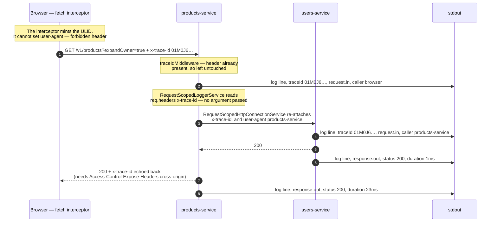
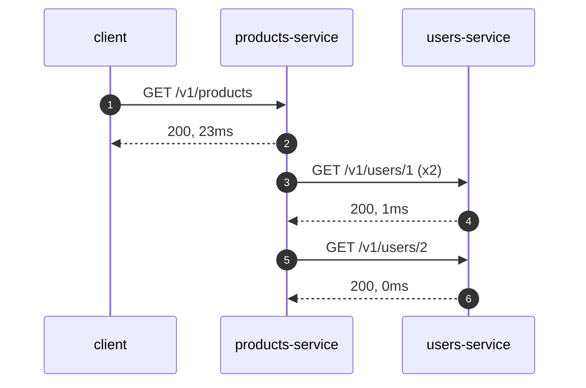

# Distributed Tracing

How a request is followed across every service it touches, without a tracing stack.

---

## The one-paragraph version

A request carries a single ULID in an HTTP header called `x-trace-id`, and every service says who it
is in `user-agent`. Every service logs both as fields in a one-line JSON record written to stdout. The container runtime already captures stdout; a
node-level log shipper already forwards it; the log store already indexes the pod labels. So
correlating one request across a dozen services is one query — and because the header is inherited
automatically through NestJS request-scoped dependency injection, application developers write no
correlation code at all.

The total application-side implementation is two headers, one middleware that seeds the first, and
two thin request-scoped wrapper providers: a logger and an HTTP connector. There is no tracing SDK, no span
context, no exporter, and nothing running next to the application process.

That is the whole architecture, and it is complete as described. The
[agent tooling](#the-tooling-you-can-cheaply-build-on-top) at the end is something we chose to build
afterwards. It is genuinely useful and it is not load-bearing.

> **This describes an approach, not a drop-in.** What is worth copying is the four decisions in
> [Applying this to other stacks](#applying-this-to-other-stacks) — not our specific values. Adopt
> it deliberately and adjust it to the system in front of you: see
> [Adapting it](#adapting-it--the-parts-that-are-ours-not-yours) for which parts are ours rather
> than yours, and why changing them is cheap.

---

## Anatomy of the contract

### The contract is two headers, and only one of them is a trace id

This is the part that is easy to get half-right, because half of it fails loudly and half of it does
not.

| Header | What it does | What happens when it is missing |
|---|---|---|
| `x-trace-id` | **Groups** every log line belonging to one request | The lines are unfindable. Obvious the first time you look for them |
| `user-agent` | **Connects** them — the receiving service records it as `caller`, and `caller` is the only edge information a trace has | The lines are all there and every one of them is correct. There is simply no call graph, and the service shows up as an orphaned root |

A flat id has no parent span id, so `caller` is not a convenience — it is the entire mechanism by
which one service's span is known to be beneath another's. **A service that forwards `x-trace-id`
and gets `user-agent` wrong produces traces that look complete and are wrong**, which is strictly
worse than producing none.

`@tw/http-connector` therefore treats the two identically: both are written last on every outbound
call, both delete any other casing variant of themselves first, neither can be set through
`headers`, and neither may appear in `forwardHeaders`. `userAgent` is a required option and
`forRoot()` throws at boot without it — see
[the identity is validated, not merely required](#the-identity-is-validated-not-merely-required).

### The trace id

| Property | Value | Source |
|---|---|---|
| Wire format | HTTP header `x-trace-id` (lowercase) | `libs/tw-tracing/src/constants.ts` |
| Value format | **any non-empty string**, capped at 128 chars inbound — a ULID at HTTP entry points, service-built elsewhere | `ulidx` |
| Example | `01M0J6EYRY4TFEPR9PHJZ1QHPF` | |
| Log field | `traceId` | `libs/tw-logger/src/formatters/json.formatter.ts` |
| Response header | `x-trace-id`, echoed to the caller | `libs/tw-tracing/src/trace-id.middleware.ts` |
| Indexed log label? | **No** — it lives in the log line body | see [Why not a label](#why-the-id-is-not-a-log-label) |

### The identity

| Property | Value | Source |
|---|---|---|
| Wire format | HTTP header `user-agent` | `libs/tw-http-connector/src/constants/index.ts` |
| Value | the service's own name — **must equal `DEPLOYMENT_NAME`** | `HttpConnectionModule.forRoot({ userAgent })` |
| Example | `products-service` | |
| Log field | `caller`, on `direction: request.in` lines only | `libs/tw-logger/src/request-logging.interceptor.ts` |
| Set by the browser? | **No — impossible.** `user-agent` is a forbidden header name in `fetch`/XHR | see [The entry point](#the-entry-point--the-browser) |
| Validated? | **Yes, at module registration** | `libs/tw-http-connector/src/http-connection.module.ts` |

**A ULID is a convention, not a contract.** Only the HTTP entry points mint one. Anything without an
inbound request builds its own id, and all of these are legitimate:

| Trace-Id | Minted by |
|---|---|
| `01M0J6EYRY4TFEPR9PHJZ1QHPF` | `newTraceId()` at an HTTP entry point |
| `01M0J6EYRY4TFEPR9PHJZ1QHPF-page-3` | a paginated sync run, `deriveTraceId(sessionId, 'page', page)` |
| `01M0J6EYRY4TFEPR9PHJZ1QHPF-chunk-2` | a parallel fan-out |

The tooling therefore validates **nothing** about the format — a format check would refuse to trace
real traffic. `deriveTraceId` appends rather than replaces, so a filter on the parent id returns the
parent *and* every derived leg; substring matching is what makes that work.

**Length is the one exception, and it is not a format check.** An id arriving on a request is an id
we did not mint — at an edge service, it came from a browser — and it is then copied onto every log
line of every service in the chain, so whatever length the caller chose is multiplied by the entire
request fan-out. `ensureTraceId` truncates an inbound id to `MAX_TRACE_ID_LENGTH` (128) and does
nothing else to it: the format stays open, and header values cannot carry control characters anyway
because Node's HTTP parser rejects those first.

The cap never fires on our own traffic — a ULID is 26 characters and `<ulid>-page-3-chunk-2` is
under 50 — so backend-to-backend calls are unaffected by design rather than by exemption. There is
no edge-vs-internal distinction to configure, and truncation is idempotent with one cap everywhere,
so a long id is shortened once at the first hop and every service after it inherits the identical
value. A cap that varied per service would split one trace in two.

### One place owns the contract

The header name is an exported constant in one package, not a string literal repeated at each call
site. That sounds like pedantry until a service forwards `x-traceid`, or the AWS token sub-request
sends `X-Trace-Id` while everything else sends lowercase, and correlation silently breaks for
exactly one hop — the hardest kind of gap to notice, because every individual log line still looks
right. `@tw/tracing` exists to make that failure impossible.

---

## The flow, end to end

### Propagation through a request



### From stdout to an answer

```mermaid
flowchart LR
    subgraph pod["Application pod — nothing added"]
        A["Node process<br/>process.stdout.write of one JSON line"]
    end
    subgraph node["Cluster node — already required"]
        K["kubelet writes /var/log/pods"]
        S["Log shipper DaemonSet<br/>hostPath mount, no parsing"]
    end
    subgraph obs["Observability"]
        L["Loki<br/>labels: namespace, container, pod, app"]
        G["Grafana"]
    end
    subgraph tools["Workspace tooling"]
        Q["LogQL: namespace selector<br/>plus a line filter on the id"]
        R["Chain reconstruction<br/>spans → edges → tree"]
        M["grafana_trace_id MCP tool<br/>+ .ai connector"]
    end

    A --> K --> S -->|push| L
    L --> G
    G -->|datasource proxy| Q
    Q --> R --> M
```



The important property of the second diagram: **the left half is not ours and not new.** Container
stdout capture and a node-level log shipper exist whether or not anything is correlated. Our
contribution is one field in the JSON and the tooling on the right.

---

## The entry point — the browser

A trace does not start at products-service. It starts in the browser, in a `fetch` interceptor that
mints one ULID per API call and sets `x-trace-id` before the request leaves the page. Everything the
rest of this document describes is *inheritance* of that id: `ensureTraceId` only mints when the
header is absent, so the first service to see the request adopts the browser's id rather than
replacing it.

That matters for a reason beyond tidiness. Without a frontend interceptor, the trace begins at the
edge service and the most common real question — *the user says the page broke, what happened?* —
starts one hop too late, with no way to get from what the user saw to the id that would answer it.

**The scope is one id per HTTP call, deliberately — not one per user action.** A screen that fires
three calls produces three traces, and `deriveTraceId` is *not* used here to tie them together.
That looks like an omission and is a decision: whoever is debugging is working on one request chain,
even when a form triggered several, so the id they need is the one for the call that misbehaved.
Grouping calls under a per-action parent buys little for that job and costs a scoping concept the
frontend would then have to own and get right.

### The interceptor

Framework-agnostic, and the whole of it. In this workspace it belongs to
[host-frontend](../../frontend/host-frontend/README.md):

```ts
// src/tracing/install-trace-interceptor.ts
import { ulid } from 'ulidx';

const TRACE_ID_HEADER = 'x-trace-id';
const MAX_TRACE_ID_LENGTH = 128; // matches @tw/tracing

/**
 * Wraps `window.fetch` so every call to our own APIs carries a trace id.
 *
 * @param apiOrigins - Origins that get the header. Everything else — CDNs, analytics, third-party
 *   widgets — is left alone: a trace id is internal correlation data and there is no reason to
 *   hand it to someone else's server.
 */
export function installTraceInterceptor(apiOrigins: string[]): void {
  const original = window.fetch;

  window.fetch = async (input, init) => {
    const request = new Request(input, init);
    if (!apiOrigins.includes(new URL(request.url).origin)) return original(request);

    // Inherit, never overwrite — the same rule the services follow. A caller that set the header
    // meant it: a retry of a failed call is the same user action and belongs under the same id.
    // The cap matches the services', so an id set here is never the thing that gets truncated.
    const inherited = request.headers.get(TRACE_ID_HEADER);
    const traceId = inherited ? inherited.slice(0, MAX_TRACE_ID_LENGTH) : ulid();
    request.headers.set(TRACE_ID_HEADER, traceId);

    const response = await original(request);

    // Surfacing the id on failure is the point of the whole exercise: it is what a user can paste
    // into a bug report, and what turns "the page broke" into one LogQL query.
    if (!response.ok) console.error(`${request.method} ${request.url} failed under trace ${traceId}`);

    return response;
  };
}
```

### Three things the browser changes about the contract

**1. The browser cannot hold up the identity half — at all.** `user-agent` is browser-controlled:
a page may ask, and the browser ignores it. Verified against a local echo server in Chromium 152 —
`fetch('/probe', { headers: { 'User-Agent': 'trace-probe-ua' } })` arrives as:

```json
{"user-agent":"Mozilla/5.0 (Macintosh; …) Chrome/152.0.0.0 Safari/537.36",
 "x-trace-id":"PROBE1","x-client-id":"products-frontend"}
```

The custom value is gone without an error; the two custom headers beside it went through untouched.
So the frontend satisfies `x-trace-id` and *structurally cannot* satisfy `user-agent`, and
`normalizeCaller` collapses anything Mozilla-shaped to the single node `browser`
(`mcp/src/grafana/trace/parse.js`).

**That is deliberate, and it has a consequence specific to this workspace.** host-frontend,
users-frontend and products-frontend are three applications federated into one page — and in every
trace they are **one** node called `browser`. Nothing distinguishes a call made by the products
catalogue from one made by the account settings screen.

If per-microfrontend attribution is wanted, it needs a header of its own. `x-client-id:
products-frontend` goes through fine — it is in the probe above — so the cost is one line in the
interceptor plus a branch in `normalizeCaller` preferring it over the UA, and one more entry in
`Access-Control-Allow-Headers`. **That is an open decision, not something the current implementation
does.** Until it is taken, read `browser` as "the page", not "the app".

**2. Cross-origin, two CORS headers are load-bearing.** Same-origin (the usual dev setup, and a
host serving its API under the same domain) needs neither, which is exactly why this breaks in
production and not locally:

| Header on the API response | Without it |
|---|---|
| `Access-Control-Allow-Headers: x-trace-id` | The preflight fails and **the request never happens** — loud, and caught immediately |
| `Access-Control-Expose-Headers: x-trace-id` | The request succeeds and `response.headers.get('x-trace-id')` returns `null`. The echo from `traceIdMiddleware` is invisible to the page, so the id never reaches a bug report — silent |

**3. Install it once, in the host.** The interceptor monkey-patches `window.fetch`, and Module
Federation remotes share one `window`. If each microfrontend installs its own, the patches stack:
three wrappers deep, three chances for one of them to mint a second id, and a load-order dependency
nobody wants to debug. The host installs it before mounting any remote; remotes just call `fetch`.

### One interceptor per HTTP client actually in use

The code above patches `fetch` because that is what it patches — it is not a claim that `fetch` is
the only client worth covering. An app calling through axios, a bare `XMLHttpRequest`, `sendBeacon`
or `EventSource` needs the equivalent hook in each, and a client left uncovered sends no
`x-trace-id` at all while everything continues to look normal.

Cover what the app actually uses and no more. In our own frontends that is **two** interceptors —
axios for the legacy code paths, `fetch` for newer ones — which is the honest shape of most real
codebases mid-migration. Both set the same header the same way, so the services downstream cannot
tell which client a request came from, and nothing beyond the frontend needs to know.

---

## Implementation

Three packages, and the split between them is the design:

| Package | Role | Size |
|---|---|---|
| [@tw/tracing](../../libs/tw-tracing/README.md) | The contract: header name, id format, the seed | ~120 lines |
| [@tw/logger](../../libs/tw-logger/README.md) | Writes the id into every log line; emits the request/response pair | ~600 lines |
| [@tw/http-connector](../../libs/tw-http-connector/README.md) | Carries the id to the next service | ~400 lines |

`@tw/logger` and `@tw/http-connector` both depend on `@tw/tracing` and not on each other, so the
header name and the id format are defined exactly once for the whole workspace.

### 1. Generation — the seed

`libs/tw-tracing/src/trace-id.ts`:

```ts
export function ensureTraceId(req: RequestLike): string {
  const existing = getTraceId(req);
  if (existing) return existing;

  const traceId = newTraceId();
  if (!req.headers) req.headers = {};
  req.headers[TRACE_ID_HEADER] = traceId;
  return traceId;
}
```

**It mutates the inbound headers object in place.** That single mutation is the mechanism that makes
everything downstream work — the request-scoped providers below read the same object. Inheriting an
existing id rather than overwriting it is what makes the trace *distributed*: the first service to
see a request creates the id, every service after it adopts one.

Adoption is one import:

```ts
@Module({ imports: [TracingModule.forRoot(), LoggerModule.forRoot()] })
export class AppModule {}
```

#### Why middleware and not an interceptor

This is the one place our implementation deliberately diverges from the obvious design, and the
reason generalises to any NestJS codebase.

The NestJS request lifecycle is **middleware → guards → interceptors → pipes → handler**. Seeding in
a global interceptor breaks in two ways:

1. **`APP_INTERCEPTOR` wins the race.** `@tw/logger` registers its request-logging interceptor
   through `APP_INTERCEPTOR`, and NestJS pushes those onto the global interceptor list during
   `NestFactory.create()` — *before* anything added afterwards by `app.useGlobalInterceptors()`
   (`ApplicationConfig.addGlobalInterceptor` pushes; `useGlobalInterceptors` concatenates later). A
   seed registered as a global interceptor therefore runs **second**, and the request.in/response.out pair
   for a request that arrived without an id is logged without one. That request is the first hop of
   every trace — precisely the one you cannot afford to lose.
2. **Guards run before interceptors at all.** A request rejected by an auth guard never reaches an
   interceptor. With an interceptor-based seed, every 401 and 403 is untraceable.

Middleware is the only stage that runs before both. Verified locally — a request with no bearer
token produces no request-log pair at all, and the trace id still ties the rejection to the caller:

```txt
15:21:43.745  warn  products-service  GET /v1/products/1   401 UNAUTHENTICATED: No token provided
```

> **If you run the interceptor form elsewhere, check this.** Requests that arrive *with* an inbound
> id work fine — the interceptor has nothing to do. Only the seeding hop loses its id, so the
> symptom is subtle: traces that begin one service too late.

### 2. The automatic path — NestJS request-scoped DI

This is the centrepiece, and it is worth being precise because the mechanism is often mis-described.

**What it is not.** There is no `AsyncLocalStorage`, no continuation-local storage, no
`nestjs-cls`, and no explicit `Scope.REQUEST` declaration anywhere.

**What it is.** NestJS promotes any provider that injects the `REQUEST` token to request scope
automatically, and that scope bubbles up to every provider depending on it. Injecting `REQUEST` is
the whole opt-in.

`libs/tw-logger/src/request-scoped-logger.service.ts`:

```ts
@Injectable()
export class RequestScopedLoggerService implements ITraceLogger {
  constructor(
    @Inject(BASE_LOGGER) private readonly logger: LoggerService,
    @Optional() @Inject(REQUEST) readonly req?: Record<string, unknown>,
  ) {}

  info(message: string, context?: string): void {
    this.logger.info(message, context, this.traceId);
  }

  get traceId(): string | undefined {
    return getTraceId(this.req);
  }
}
```

The developer-facing consequence, which is the thing to demo:

```ts
// What a developer writes — two arguments, no trace id anywhere
this.logger.warn(`User ${id} not found`, 'UsersService.findOne');
```

```json
{"timestamp":"2026-09-05T15:21:43.738Z","level":"warn","serviceName":"users-service",
 "podId":"b4799cf77-8t452","context":"UsersService.findOne",
 "traceId":"01M0J6EYRY4TFEPR9PHJZ1QHPF","message":"User 9 not found"}
```

**The singleton/wrapper split** is what keeps this cheap. `logger.module.ts`:

```ts
providers: [
  LoggerService,
  { provide: BASE_LOGGER, useExisting: LoggerService },   // one instance for the process
  RequestScopedLoggerService,                              // one small wrapper per request
  { provide: APP_INTERCEPTOR, useFactory: /* request logging */ },
],
```

`useExisting` — not `useClass` — means the heavyweight configured logger is reused across requests
and only the paper-thin scope-aware wrapper is instantiated per request.

**The same idiom appears twice**, once per outbound concern, and that is the whole story of how it
scales:

| Wrapper | Singleton token | Package |
|---|---|---|
| `RequestScopedLoggerService` | `BASE_LOGGER` | `@tw/logger` |
| `RequestScopedHttpConnectionService` | `BASE_HTTP_CONNECTOR` | `@tw/http-connector` |

Adding a third outbound concern — a message broker, a cache, an audit trail — is the same 40 lines
again. That is the extension point.

#### Three precise limits of the automatic path

Designed trade-offs, not gaps. They explain why the manual path below exists.

1. **It is opt-in per injection site.** Code that injects `LoggerService` directly still passes
   `traceId` by hand. Automatic behaviour belongs to the request-scoped wrappers only.
2. **`@Optional()` is load-bearing.** Outside an HTTP request — a cron tick, `onModuleInit`,
   bootstrap — the `REQUEST` token cannot resolve. `@Optional()` turns that into `req === undefined`
   instead of a DI failure, and `traceId` silently becomes `undefined`. No error, and **no fallback
   id**. Silent is correct here: a logger that throws during startup is worse than a log line
   without an id.
3. **It does not survive an async boundary.** The context is DI-scoped rather than
   `AsyncLocalStorage`-scoped, so work deferred past the response — a floating promise, a message
   handed to a broker — loses it. This is why an id belongs in a message payload.

### 3. Outbound propagation

`libs/tw-http-connector/src/request-scoped-http-connection.service.ts` — the entire propagation is
one spread:

```ts
return this.baseConnector.connect<RT, DT, B>({
  ...params,
  ...(!params.traceId && { traceId: getTraceId(this.req) }),
  headers: { ...forwarded, ...objectKeysToLowerCase(params.headers) },
});
```

An explicit `params.traceId` wins; inheritance is the fallback, never an override. Note that the
trace id is deliberately **not** part of `forwardHeaders` — it has its own dedicated path, so no
reconfiguration of header forwarding can silently switch tracing off.

Where both contract headers reach the wire, `http-connection.service.ts` — one rule applied twice:

```ts
const headers: Record<string, string> = { ...incoming };

// Written last, and every other casing variant deleted first. Both of them, every call.
this.setContractHeader(headers, USER_AGENT_HEADER, userAgent ?? this.options.userAgent, 'User-Agent');
if (traceId) this.setContractHeader(headers, TRACE_ID_HEADER, traceId);
```

A request carrying both `X-Trace-Id` and `x-trace-id` is a request whose receiver picks one at
random. The same is true of `User-Agent` and `user-agent`, with one extra twist that makes it worse:
they are two distinct keys in a plain object and become one header only at the `fetch` boundary,
where they are **combined** into `orders-service, curl/8.4.0` rather than resolved. Nothing before
the wire would have shown it. Writing both headers through the same delete-then-write helper is what
guarantees exactly one of each.

Because they are written *after* the caller's headers, neither can be overridden through `headers`.
The one deliberate escape hatch is the per-call `userAgent` option, for a third-party API that
demands a specific identity and is not part of our traces anyway.

#### The identity is validated, not merely required

`userAgent` has always been required by `IHttpConnectionOptions`. That is not the same as being
enforced, and this is the one field where the difference is expensive:

```ts
HttpConnectionModule.forRoot({ userAgent: process.env.DEPLOYMENT_NAME, logger })
```

Well-typed at compile time, `undefined` at runtime in any deployment that does not set the variable.
`forRoot` drops explicitly-undefined keys so no default fills it in, and the service boots, serves
traffic, and identifies itself as `"undefined"` on every outbound call. Nothing throws, every log
line still validates, and the service silently vanishes from the call graph of every trace it takes
part in.

So `forRoot()` now refuses to build the module:

- **A missing, blank or non-string `userAgent` throws at registration.** Failing at boot is the only
  cheap detection point; the alternative is noticing months later that one service's calls have
  always been orphaned roots.
- **`forwardHeaders` may not contain `user-agent` or `x-trace-id`.** Both are written
  unconditionally, so forwarding one as well means the inbound value — the browser's
  `Mozilla/5.0…` — competes with the connector's own for the same header.

What is still *not* checked, because the connector cannot see it: that `userAgent` equals the
`serviceName` the logger uses. Both read `DEPLOYMENT_NAME` in `app.module.ts` for exactly that
reason. `spans.js` keeps a `CALLER_ALIASES` map for services where they drifted, and its own comment
calls it "a workaround, not a fix" — an entry there means a chain that only reconstructs for someone
holding this tool.

| | `HttpConnectionService` | `RequestScopedHttpConnectionService` |
|---|---|---|
| DI scope | singleton | request-scoped (implicit, via `@Inject(REQUEST)`) |
| Trace id | `params.traceId`, else an `x-trace-id` in `params.headers`. **Never ambient** | inherited from the inbound request unless overridden |
| Does the work | yes — fetch, retry, timeout, parsing, error mapping | no — assembles headers, then delegates |
| Correct use | cron, bootstrap, queue consumers | request handlers |

The singleton's refusal to read an ambient id is deliberate: a process-wide object that reaches for
request state is how a trace id ends up attached to the wrong request under concurrency.

### 4. The manual fallback

Where there is no inbound request, the id is threaded by hand:

```ts
const sessionTraceId = newTraceId();

do {
  const traceId = deriveTraceId(sessionTraceId, 'page', currentPage);
  this.logger.info(`Processing page ${currentPage}`, 'SyncService.run', traceId);

  const response = await this.connector.connect({ url, method: 'GET', traceId });
  // parallel chunks get a further suffix so they stay distinguishable
  await Promise.all(chunks.map((ids, i) => this.fetchChunk(ids, deriveTraceId(traceId, 'chunk', i))));
} while (hasMore);
```

Why the automatic path cannot work here: the entry point is a cron `onTick`, so there is no
`ExecutionContext` and no request object for `REQUEST` to resolve.

For an async broker, persist the id **in the message payload**. The two halves of a broker hop
behave differently, and this is the clarifying detail:

| Leg | Context available? | Mechanism |
|---|---|---|
| **Publish** — service → broker | yes, still inside the originating request | automatic, via the request-scoped connector |
| **Delivery** — broker → subscriber | no, the request returned long ago | manual: read the id back out of the payload |

So the publish side needs no manual threading at all. Only delivery does.

### 5. What actually makes the chain reconstructable

A trace id alone only *groups* log lines. What turns them into a call graph is the request-log pair
emitted by `libs/tw-logger/src/request-logging.interceptor.ts`, auto-registered via
`APP_INTERCEPTOR`:

```json
{"direction":"request.in","method":"GET","path":"/v1/users/1","caller":"products-service"}
{"direction":"response.out","method":"GET","path":"/v1/users/1","statusCode":200,"duration":1}
```

| `direction` | Written by | Means |
|---|---|---|
| `request.in` | the request-logging interceptor | a request arrived at this service |
| `response.out` | the request-logging interceptor | this service answered it |
| `request.out` | `@tw/http-connector` | this service called someone else |
| `response.in` | `@tw/http-connector` | that call came back |

**The noun comes first because the direction alone is ambiguous.** A response this service sends and
a request this service makes are both, in plain English, "outgoing" — which is what the earlier
`incoming`/`outgoing` pair meant to readers, and it was not what they meant in the code. Both of
those described the *server* side of one request.

All four are written at `info`. **The caller's pair is the half a trace cannot get anywhere else:**
the callee's `request.in` exists only if the callee logs at all, so a call to a service that has not
adopted `@tw/logger` — another team's, a sidecar's, a third party's — is recorded by the caller or
not at all. It also carries the only client-observed `duration` in the system, which includes
network time that the callee's in-process measurement cannot see.

`verboseLogs` adds a second, detailed pair at `verbose` with masked headers and bodies. That is a
debugging aid; the `info` pair is the record.

Span reconstruction still builds edges from `caller` on the callee's `request.in` — the caller's
pair is parsed and available but not yet used for pairing. Wiring it in is what would make edges
exact rather than inferred, and it is the open item in `mcp/src/grafana/trace/spans.js`.

> **Reading traces that straddle this rename.** `incoming` and `outgoing` were the previous
> spellings of `request.in` and `response.out`. The parser accepts both and normalises to the new
> pair, because Loki holds pre-rename lines for as long as retention allows and a trace spanning a
> deploy contains a mix. A parser that understood only the new values would return half a trace.

Three things follow, all worth knowing:

- **`caller` is the forwarded `user-agent`** — the second half of the contract, arriving. That is
  the only edge information available; there is no parent span id. A service whose outbound
  `User-Agent` disagrees with the name it logs under produces edges that match no node, and its
  calls appear as orphaned roots. Each individual log line still looks perfectly correct, which is
  what makes it hard to spot. Both values are read from `DEPLOYMENT_NAME` in `app.module.ts`
  precisely so they cannot drift. Requests from the page carry the browser's own UA and are
  attributed to `browser` — see [The entry point](#the-entry-point--the-browser).
- **`duration` is measured in-process**, so it is immune to clock skew between pods. It is not
  network time.
- **The payload is a JSON document nested inside `message`.** Any consumer parses twice. That keeps
  the outer envelope one fixed shape for every line in the system.
- Health, version, ready and metrics paths are excluded by default. Left in, they would be most of
  the log volume and every probe would be a root span nobody asked for.

---

## The log record

`libs/tw-logger/src/formatters/json.formatter.ts` is the on-the-wire contract:

```json
{"timestamp":"…","level":"info","serviceName":"users-service","podId":"b4799cf77-8t452","context":"UsersService.findOne","traceId":"01M0J6…","message":"…","trace":"…"}
```

Field order is contractual and asserted in the tests — raw lines are read by humans in Grafana, and
a stable shape is what makes them scannable. When absent, `traceId` is **omitted entirely** rather
than set to `null`; a null field would match every untraced line in a substring search.

Transport is a raw `process.stdout.write`, with no logging framework underneath:

```ts
if (entry.level === 'error') process.stderr.write(output);
else process.stdout.write(output);
```

That is not minimalism for its own sake. There is no buffer to flush, no transport to fail, and no
queue that can drop the line you needed — including during the crash you are trying to diagnose.

`serviceName` comes from `DEPLOYMENT_NAME`, which must equal the container name. That identity —
container label = `DEPLOYMENT_NAME` = `serviceName` = outbound `User-Agent` — is what lets
label-based and body-based attribution agree.

### Why the id is not a log label

Loki indexes labels, not line contents. Promoting a per-request id to a label would mean unbounded
cardinality, which is pathological for the index. A narrow label selector plus a line filter is the
shape the database is built for:

```logql
{namespace=~"team-workspace"} |= "01M0J6EYRY4TFEPR9PHJZ1QHPF"
```

That single query *is* the distributed trace lookup.

---

## What a developer has to do

| To get | You do |
|---|---|
| A trace id on the very first hop | install the `fetch` interceptor once, in the host frontend |
| A trace id on every inbound request | `TracingModule.forRoot()` — one import |
| An edge from this service to the ones it calls | `HttpConnectionModule.forRoot({ userAgent: DEPLOYMENT_NAME })` — required, and it throws without it |
| The id on every log line | inject `RequestScopedLoggerService` instead of `LoggerService` |
| The id on every outbound call | inject `RequestScopedHttpConnectionService` |
| Request/response logs that build the call graph | nothing — `LoggerModule.forRoot()` registers the interceptor |
| Correlation in cron / queue work | pass `traceId` explicitly as the trailing argument |

That is the whole developer contract. **No** span creation, no context managers, no
`startActiveSpan`, no instrumentation registration, no propagator configuration.

---

## The honest comparison with OpenTelemetry

### What is actually true

- **This correlation path uses no tracing SDK, no exporter, no collector, and no sidecar.**
  Correlation is a header, a JSON field, and a substring search.
- **Nothing runs alongside the application process.** A service writes one line to file descriptor 1
  and is finished. No in-process exporter, no batching, no queue, no per-pod agent.
- **The collection layer is not additional cost.** Container stdout capture is a given, and a
  node-level log shipper is required for any log strategy at all. This rides on infrastructure that
  exists regardless.
- **The failure mode is benign.** If the log store is down you lose *search*, not the request. There
  is no exporter in the request path to block, buffer, or drop, and no sampling decision that can
  discard the one trace you needed.
- **The engineering cost is genuinely small.** The mechanism is ~120 lines in `@tw/tracing`, ~70 in
  the request-scoped logger, ~65 in the request-scoped connector, and ~170 in the request-logging
  interceptor.

### What is NOT true — do not claim these

- ❌ **"This replaces OpenTelemetry."** It does not. It replaces the *correlation* use case. Span
  topology, sub-operation timing, and database/cache/broker internals are things OpenTelemetry gives
  you and this does not.
- ❌ **"There is no log collector."** There is. A log-shipper DaemonSet and a log store are running;
  they are simply not ours and not new.
- ❌ **"It costs nothing."** Log volume is a real cost, and request logging adds two lines per
  request per service.

### The defensible framing

> Trace-Id correlation uses no tracing SDK, no OTLP exporter and no collector. Services write one
> JSON line to stdout; the node-level log shipper that container log collection requires anyway
> picks it up; the log store indexes the pod labels and we filter the line. If OpenTelemetry
> auto-instrumentation is also enabled for traces and metrics, the two are independent — this path
> never touches it.

### The trade-offs, stated fairly

| | Trace-Id + Loki | OpenTelemetry tracing |
|---|---|---|
| Application code | header + log field; nothing per-call | SDK, propagators, spans (auto-instrumentation reduces this) |
| Per-call identity | **none** — one flat id for the whole request | span id + parent span id |
| Parent/child edges | **inferred** from forwarded `user-agent` + timestamps | explicit and exact |
| Browser → first service | one node, `browser` — the page cannot name itself in `user-agent` | the browser SDK emits a real root span |
| Concurrent identical calls | ambiguous; flagged `ambiguous: true` | exact |
| Sampling | none — every request is in the logs | usually sampled |
| Timing fidelity | in-process `duration` per request | per-span, sub-operation granularity |
| DB / cache / broker internals | not visible | visible via instrumentation |
| Retention | log retention | trace-backend retention, typically shorter |
| Cost when idle | zero beyond existing logging | collector + storage |
| Failure impact | lose search, not the request | exporter in the request path |

The honest summary: **exact span topology was traded for near-zero implementation and operational
cost**, and the savings were spent on tooling that recovers most of the topology heuristically.

---

## The tooling you can cheaply build on top

**Nothing above depends on this section.** A trace id plus one LogQL query already returns every
correlated line, in Grafana, with no tooling of our own. For most investigations that is the whole
job.

What follows makes a point that stands on its own: once correlation lives in your own log lines,
purpose-built tooling over them is cheap. You are not waiting on a vendor roadmap, not bending your
workflow to fit someone else's UI, and not adding a runtime dependency to anything that ships.

`mcp/src/grafana/trace/` is dependency-free JavaScript. It is not deployed, not published, and not
in any service's dependency tree; deleting it tomorrow would not affect a single running service or
change one line of application code.

| Piece | What it does |
|---|---|
| `trace/parse.js` | Loki lines → typed events. Three log shapes tolerated |
| `trace/spans.js` | Pairs `request.in`/`response.out` into spans; builds edges, the call tree, coverage |
| `trace/render.js` | Mermaid sequence diagram + Markdown report |
| `trace/index.js` | Orchestration, id extraction, LogQL construction, the compact summary |
| `grafana_trace_id` | The MCP tool an agent calls |
| `.ai/connectors/grafana/trace-id.mjs` | The same engine from a shell |

### Being honest about the heuristics

A flat id carries no span identity, so pairing a `request.in` with its `response.out` is done per
`(service, method, path)` in timestamp order. That is exact for sequential calls and a best-effort
guess when one caller hits the same endpoint concurrently.

The tool declares its own uncertainty rather than hiding it:

- **`paired: false` / `ambiguous: true`** mean *"do not trust the elapsed time"*, never *"the call
  did not happen"*.
- **`unterminated`** means a request never produced a response — a crash, a timeout, or a request
  still in flight. Flagged, not dropped: it is often the answer.
- **`services.gaps`** lists services that took part but emitted no request logs. **A gap never means
  the service was skipped.** It usually means it has not adopted `@tw/logger`, is running below
  `info` level, or is not ours.
- **`found: false` with an unreachable probe is not proof of absence.** Distinguishing "searched and
  empty" from "could not look" matters: a tool that collapses those into "no results" eventually
  sends someone to the wrong conclusion.
- **Clock skew** is assumed. A callee's log can predate its caller's, so nesting picks the *nearest*
  preceding call at the caller rather than promoting a nested call to a root over a few milliseconds.
- **Repeated calls are surfaced, not resolved.** Two identical calls in one request are either cache
  misses or duplicated work; the tool reports the count and refuses to guess which.

### A real reconstruction

Verified locally against both services. One request to products-service, fanning out to
users-service for each product's owner:



The `(x2)` is a genuine finding the tool surfaced without anyone looking for it: two of the three
products share an owner, and the code resolves each product's owner independently. That is an N+1
against users-service, reported as a `repeatedEdges` entry.

---

## Applying this to other stacks

Nothing here is really about NestJS. The mechanism is four decisions, and only the third has a
framework-shaped answer:

1. **One header name, owned by one module.** Any language.
2. **One structured log line per record, with the id as a field, written to stdout.** Any logging
   library that can emit JSON.
3. **A way to make the id ambient for the duration of a request**, so application code does not pass
   it. NestJS request-scoped DI is what we use. Elsewhere:
   - **Express / Fastify / Koa** — `traceIdMiddleware()` ships in `@tw/tracing` and imports no
     framework. Attach a per-request logger to `req` and the shape is identical.
   - **Node without a DI container** — `AsyncLocalStorage` gives you ambient context that, unlike
     DI scope, *does* survive async boundaries.
   - **Go** — `context.Context` is the same idea with a different name.
   - **Python** — `contextvars`, plus a logging filter that injects the id.
   - **Java / Spring** — MDC with a servlet filter is the canonical form.
   - **Frontend** — mint an id per HTTP call in your API client and set the header; see
     [The entry point](#the-entry-point--the-browser) for the interceptor, the CORS requirements,
     and why the browser can never supply the identity half.
4. **An outbound client that re-attaches the header — and states who it is.** Wherever your services
   already share an HTTP client, that is two lines, and the second one is the one people forget.
   Make the identity a required constructor argument rather than an option with a default: a client
   that can be built without one will be.

The two halves that carry all the value — the header and the request/response log pair — are wire
formats, not code. A service written in another language, by another team, joins the same traces the
moment it forwards the header and logs the field. That is the practical argument for keeping the
contract this small.

### Adapting it — the parts that are ours, not yours

Read the decisions above as the design and everything else as one worked example. Several choices
here are ours because they suited our system, and they are the first things to re-examine rather
than inherit:

| Ours | Change it when |
|---|---|
| `user-agent` carries the caller identity | A mesh or gateway rewrites it, you need per-client attribution the UA cannot express, or you want the edge stated by the caller instead of inferred. Add a dedicated header, or log the caller's own outbound record — nothing else in the design depends on it being `user-agent` |
| A ULID minted per HTTP call | Your debugging starts from something else — a session, a job, a UI action. The id is any non-empty string, so use the identifier your system already reasons about |
| `x-trace-id` as the header name | It collides with something, or a platform you sit behind already propagates its own |
| A `fetch` interceptor at the entry point | Your frontend uses a different client — see [The entry point](#the-entry-point--the-browser) |
| Four `info` records per hop — two served, two called | Your log budget differs. The caller's pair is the one to drop first; it costs volume and buys visibility into services that do not log |

**The reason this stays cheap is that it lives in libraries, not in services.** The header name, the
id format and the log shape are each defined once. Changing one is a version bump and a rollout, not
a search through a dozen repositories — and the rollout is mechanical: bump the dependency across
every service, apply the config change, run the gates locally (tests, linters, a live run with a
probe), push. That is a scripted job, not a project.

That is the real argument for the three-package split, and it is worth stating plainly because the
packages otherwise look like ceremony around ~120 lines of code: **the split is what makes a change
to the contract a routine action instead of a migration.** A team that inlines the header name at
each call site has the same system on day one and no way to change it on day two.

---

## Related

- [Tracing a Request](../guides/tracing-a-request.md) — the runbook: what to do when something breaks
- [@tw/tracing](../../libs/tw-tracing/README.md) · [@tw/logger](../../libs/tw-logger/README.md) ·
  [@tw/http-connector](../../libs/tw-http-connector/README.md)
- [API Contracts](./api-contracts.md) — where `x-trace-id` sits in the request contract
- [Architecture Overview](./architecture.md)
