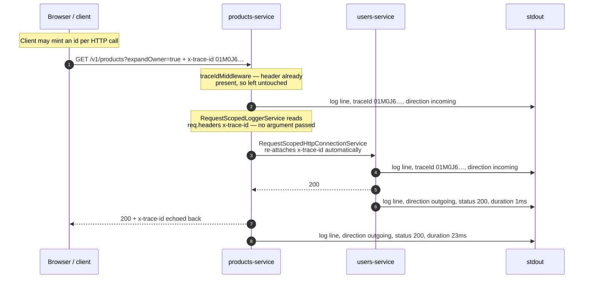
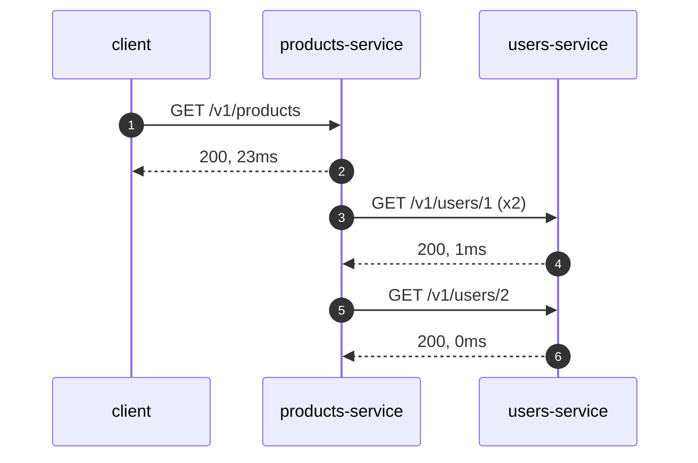

# Distributed Tracing

How a request is followed across every service it touches, without a tracing stack.

---

## The one-paragraph version

A request carries a single ULID in an HTTP header called `x-trace-id`. Every service logs it as a
field in a one-line JSON record written to stdout. The container runtime already captures stdout; a
node-level log shipper already forwards it; the log store already indexes the pod labels. So
correlating a user action across a dozen services is one query — and because the header is inherited
automatically through NestJS request-scoped dependency injection, application developers write no
correlation code at all.

The total application-side implementation is one header, one middleware that seeds it, and two thin
request-scoped wrapper providers: a logger and an HTTP connector. There is no tracing SDK, no span
context, no exporter, and nothing running next to the application process.

That is the whole architecture, and it is complete as described. The
[agent tooling](#the-tooling-you-can-cheaply-build-on-top) at the end is something we chose to build
afterwards. It is genuinely useful and it is not load-bearing.

---

## Anatomy of a Trace-Id

| Property | Value | Source |
|---|---|---|
| Wire format | HTTP header `x-trace-id` (lowercase) | `libs/tw-tracing/src/constants.ts` |
| Value format | **any non-empty string** — a ULID at HTTP entry points, service-built elsewhere | `ulidx` |
| Example | `01M0J6EYRY4TFEPR9PHJZ1QHPF` | |
| Log field | `traceId` | `libs/tw-logger/src/formatters/json.formatter.ts` |
| Response header | `x-trace-id`, echoed to the caller | `libs/tw-tracing/src/trace-id.middleware.ts` |
| Indexed log label? | **No** — it lives in the log line body | see [Why not a label](#why-the-id-is-not-a-log-label) |

**A ULID is a convention, not a contract.** Only the HTTP entry points mint one. Anything without an
inbound request builds its own id, and all of these are legitimate:

| Trace-Id | Minted by |
|---|---|
| `01M0J6EYRY4TFEPR9PHJZ1QHPF` | `newTraceId()` at an HTTP entry point |
| `01M0J6EYRY4TFEPR9PHJZ1QHPF-page-3` | a paginated sync run, `deriveTraceId(sessionId, 'page', page)` |
| `01M0J6EYRY4TFEPR9PHJZ1QHPF-chunk-2` | a parallel fan-out |

The tooling therefore validates **nothing** about the format — a format check would refuse to trace
real traffic. `deriveTraceId` appends rather than replaces, so a filter on the parent id returns the
parent *and* every derived leg; substring matching is what makes that work.

### One place owns the contract

The header name is an exported constant in one package, not a string literal repeated at each call
site. That sounds like pedantry until a service forwards `x-traceid`, or the AWS token sub-request
sends `X-Trace-Id` while everything else sends lowercase, and correlation silently breaks for
exactly one hop — the hardest kind of gap to notice, because every individual log line still looks
right. `@tw/tracing` exists to make that failure impossible.

---

## The flow, end to end

### Propagation through a request



### From stdout to an answer

```mermaid
flowchart LR
    subgraph pod["Application pod — nothing added"]
        A["Node process<br/>process.stdout.write of one JSON line"]
    end
    subgraph node["Cluster node — already required"]
        K["kubelet writes /var/log/pods"]
        S["Log shipper DaemonSet<br/>hostPath mount, no parsing"]
    end
    subgraph obs["Observability"]
        L["Loki<br/>labels: namespace, container, pod, app"]
        G["Grafana"]
    end
    subgraph tools["Workspace tooling"]
        Q["LogQL: namespace selector<br/>plus a line filter on the id"]
        R["Chain reconstruction<br/>spans → edges → tree"]
        M["grafana_trace_id MCP tool<br/>+ .ai connector"]
    end

    A --> K --> S -->|push| L
    L --> G
    G -->|datasource proxy| Q
    Q --> R --> M
```



The important property of the second diagram: **the left half is not ours and not new.** Container
stdout capture and a node-level log shipper exist whether or not anything is correlated. Our
contribution is one field in the JSON and the tooling on the right.

---

## Implementation

Three packages, and the split between them is the design:

| Package | Role | Size |
|---|---|---|
| [@tw/tracing](../../libs/tw-tracing/README.md) | The contract: header name, id format, the seed | ~120 lines |
| [@tw/logger](../../libs/tw-logger/README.md) | Writes the id into every log line; emits the request/response pair | ~600 lines |
| [@tw/http-connector](../../libs/tw-http-connector/README.md) | Carries the id to the next service | ~400 lines |

`@tw/logger` and `@tw/http-connector` both depend on `@tw/tracing` and not on each other, so the
header name and the id format are defined exactly once for the whole workspace.

### 1. Generation — the seed

`libs/tw-tracing/src/trace-id.ts`:

```ts
export function ensureTraceId(req: RequestLike): string {
  const existing = getTraceId(req);
  if (existing) return existing;

  const traceId = newTraceId();
  if (!req.headers) req.headers = {};
  req.headers[TRACE_ID_HEADER] = traceId;
  return traceId;
}
```

**It mutates the inbound headers object in place.** That single mutation is the mechanism that makes
everything downstream work — the request-scoped providers below read the same object. Inheriting an
existing id rather than overwriting it is what makes the trace *distributed*: the first service to
see a request creates the id, every service after it adopts one.

Adoption is one import:

```ts
@Module({ imports: [TracingModule.forRoot(), LoggerModule.forRoot()] })
export class AppModule {}
```

#### Why middleware and not an interceptor

This is the one place our implementation deliberately diverges from the obvious design, and the
reason generalises to any NestJS codebase.

The NestJS request lifecycle is **middleware → guards → interceptors → pipes → handler**. Seeding in
a global interceptor breaks in two ways:

1. **`APP_INTERCEPTOR` wins the race.** `@tw/logger` registers its request-logging interceptor
   through `APP_INTERCEPTOR`, and NestJS pushes those onto the global interceptor list during
   `NestFactory.create()` — *before* anything added afterwards by `app.useGlobalInterceptors()`
   (`ApplicationConfig.addGlobalInterceptor` pushes; `useGlobalInterceptors` concatenates later). A
   seed registered as a global interceptor therefore runs **second**, and the incoming/outgoing pair
   for a request that arrived without an id is logged without one. That request is the first hop of
   every trace — precisely the one you cannot afford to lose.
2. **Guards run before interceptors at all.** A request rejected by an auth guard never reaches an
   interceptor. With an interceptor-based seed, every 401 and 403 is untraceable.

Middleware is the only stage that runs before both. Verified locally — a request with no bearer
token produces no request-log pair at all, and the trace id still ties the rejection to the caller:

```txt
15:21:43.745  warn  products-service  GET /v1/products/1   401 UNAUTHENTICATED: No token provided
```

> **If you run the interceptor form elsewhere, check this.** Requests that arrive *with* an inbound
> id work fine — the interceptor has nothing to do. Only the seeding hop loses its id, so the
> symptom is subtle: traces that begin one service too late.

### 2. The automatic path — NestJS request-scoped DI

This is the centrepiece, and it is worth being precise because the mechanism is often mis-described.

**What it is not.** There is no `AsyncLocalStorage`, no continuation-local storage, no
`nestjs-cls`, and no explicit `Scope.REQUEST` declaration anywhere.

**What it is.** NestJS promotes any provider that injects the `REQUEST` token to request scope
automatically, and that scope bubbles up to every provider depending on it. Injecting `REQUEST` is
the whole opt-in.

`libs/tw-logger/src/request-scoped-logger.service.ts`:

```ts
@Injectable()
export class RequestScopedLoggerService implements ITraceLogger {
  constructor(
    @Inject(BASE_LOGGER) private readonly logger: LoggerService,
    @Optional() @Inject(REQUEST) readonly req?: Record<string, unknown>,
  ) {}

  info(message: string, context?: string): void {
    this.logger.info(message, context, this.traceId);
  }

  get traceId(): string | undefined {
    return getTraceId(this.req);
  }
}
```

The developer-facing consequence, which is the thing to demo:

```ts
// What a developer writes — two arguments, no trace id anywhere
this.logger.warn(`User ${id} not found`, 'UsersService.findOne');
```

```json
{"timestamp":"2026-09-05T15:21:43.738Z","level":"warn","serviceName":"users-service",
 "podId":"b4799cf77-8t452","context":"UsersService.findOne",
 "traceId":"01M0J6EYRY4TFEPR9PHJZ1QHPF","message":"User 9 not found"}
```

**The singleton/wrapper split** is what keeps this cheap. `logger.module.ts`:

```ts
providers: [
  LoggerService,
  { provide: BASE_LOGGER, useExisting: LoggerService },   // one instance for the process
  RequestScopedLoggerService,                              // one small wrapper per request
  { provide: APP_INTERCEPTOR, useFactory: /* request logging */ },
],
```

`useExisting` — not `useClass` — means the heavyweight configured logger is reused across requests
and only the paper-thin scope-aware wrapper is instantiated per request.

**The same idiom appears twice**, once per outbound concern, and that is the whole story of how it
scales:

| Wrapper | Singleton token | Package |
|---|---|---|
| `RequestScopedLoggerService` | `BASE_LOGGER` | `@tw/logger` |
| `RequestScopedHttpConnectionService` | `BASE_HTTP_CONNECTOR` | `@tw/http-connector` |

Adding a third outbound concern — a message broker, a cache, an audit trail — is the same 40 lines
again. That is the extension point.

#### Three precise limits of the automatic path

Designed trade-offs, not gaps. They explain why the manual path below exists.

1. **It is opt-in per injection site.** Code that injects `LoggerService` directly still passes
   `traceId` by hand. Automatic behaviour belongs to the request-scoped wrappers only.
2. **`@Optional()` is load-bearing.** Outside an HTTP request — a cron tick, `onModuleInit`,
   bootstrap — the `REQUEST` token cannot resolve. `@Optional()` turns that into `req === undefined`
   instead of a DI failure, and `traceId` silently becomes `undefined`. No error, and **no fallback
   id**. Silent is correct here: a logger that throws during startup is worse than a log line
   without an id.
3. **It does not survive an async boundary.** The context is DI-scoped rather than
   `AsyncLocalStorage`-scoped, so work deferred past the response — a floating promise, a message
   handed to a broker — loses it. This is why an id belongs in a message payload.

### 3. Outbound propagation

`libs/tw-http-connector/src/request-scoped-http-connection.service.ts` — the entire propagation is
one spread:

```ts
return this.baseConnector.connect<RT, DT, B>({
  ...params,
  ...(!params.traceId && { traceId: getTraceId(this.req) }),
  headers: { ...forwarded, ...objectKeysToLowerCase(params.headers) },
});
```

An explicit `params.traceId` wins; inheritance is the fallback, never an override. Note that the
trace id is deliberately **not** part of `forwardHeaders` — it has its own dedicated path, so no
reconfiguration of header forwarding can silently switch tracing off.

Where the header reaches the wire, `http-connection.service.ts`:

```ts
if (traceId) {
  // Remove any existing casing variant to avoid duplicates on the wire.
  for (const key of Object.keys(headers)) {
    if (key.toLowerCase() === TRACE_ID_HEADER) delete headers[key];
  }
  headers[TRACE_ID_HEADER] = traceId;
}
```

A request carrying both `X-Trace-Id` and `x-trace-id` is a request whose receiver picks one at
random. The dedupe loop guarantees exactly one variant.

| | `HttpConnectionService` | `RequestScopedHttpConnectionService` |
|---|---|---|
| DI scope | singleton | request-scoped (implicit, via `@Inject(REQUEST)`) |
| Trace id | `params.traceId`, else an `x-trace-id` in `params.headers`. **Never ambient** | inherited from the inbound request unless overridden |
| Does the work | yes — fetch, retry, timeout, parsing, error mapping | no — assembles headers, then delegates |
| Correct use | cron, bootstrap, queue consumers | request handlers |

The singleton's refusal to read an ambient id is deliberate: a process-wide object that reaches for
request state is how a trace id ends up attached to the wrong request under concurrency.

### 4. The manual fallback

Where there is no inbound request, the id is threaded by hand:

```ts
const sessionTraceId = newTraceId();

do {
  const traceId = deriveTraceId(sessionTraceId, 'page', currentPage);
  this.logger.info(`Processing page ${currentPage}`, 'SyncService.run', traceId);

  const response = await this.connector.connect({ url, method: 'GET', traceId });
  // parallel chunks get a further suffix so they stay distinguishable
  await Promise.all(chunks.map((ids, i) => this.fetchChunk(ids, deriveTraceId(traceId, 'chunk', i))));
} while (hasMore);
```

Why the automatic path cannot work here: the entry point is a cron `onTick`, so there is no
`ExecutionContext` and no request object for `REQUEST` to resolve.

For an async broker, persist the id **in the message payload**. The two halves of a broker hop
behave differently, and this is the clarifying detail:

| Leg | Context available? | Mechanism |
|---|---|---|
| **Publish** — service → broker | yes, still inside the originating request | automatic, via the request-scoped connector |
| **Delivery** — broker → subscriber | no, the request returned long ago | manual: read the id back out of the payload |

So the publish side needs no manual threading at all. Only delivery does.

### 5. What actually makes the chain reconstructable

A trace id alone only *groups* log lines. What turns them into a call graph is the request-log pair
emitted by `libs/tw-logger/src/request-logging.interceptor.ts`, auto-registered via
`APP_INTERCEPTOR`:

```json
{"direction":"incoming","method":"GET","path":"/v1/users/1","caller":"products-service"}
{"direction":"outgoing","method":"GET","path":"/v1/users/1","statusCode":200,"duration":1}
```

Three things follow, all worth knowing:

- **`caller` is the forwarded `user-agent`.** That is the only edge information available — there is
  no parent span id. A service whose outbound `User-Agent` disagrees with the name it logs under
  produces edges that match no node, and its calls appear as orphaned roots. Each individual log
  line still looks perfectly correct, which is what makes it hard to spot. Both values are read from
  `DEPLOYMENT_NAME` in `app.module.ts` precisely so they cannot drift.
- **`duration` is measured in-process**, so it is immune to clock skew between pods. It is not
  network time.
- **The payload is a JSON document nested inside `message`.** Any consumer parses twice. That keeps
  the outer envelope one fixed shape for every line in the system.
- Health, version, ready and metrics paths are excluded by default. Left in, they would be most of
  the log volume and every probe would be a root span nobody asked for.

---

## The log record

`libs/tw-logger/src/formatters/json.formatter.ts` is the on-the-wire contract:

```json
{"timestamp":"…","level":"info","serviceName":"users-service","podId":"b4799cf77-8t452","context":"UsersService.findOne","traceId":"01M0J6…","message":"…","trace":"…"}
```

Field order is contractual and asserted in the tests — raw lines are read by humans in Grafana, and
a stable shape is what makes them scannable. When absent, `traceId` is **omitted entirely** rather
than set to `null`; a null field would match every untraced line in a substring search.

Transport is a raw `process.stdout.write`, with no logging framework underneath:

```ts
if (entry.level === 'error') process.stderr.write(output);
else process.stdout.write(output);
```

That is not minimalism for its own sake. There is no buffer to flush, no transport to fail, and no
queue that can drop the line you needed — including during the crash you are trying to diagnose.

`serviceName` comes from `DEPLOYMENT_NAME`, which must equal the container name. That identity —
container label = `DEPLOYMENT_NAME` = `serviceName` = outbound `User-Agent` — is what lets
label-based and body-based attribution agree.

### Why the id is not a log label

Loki indexes labels, not line contents. Promoting a per-request id to a label would mean unbounded
cardinality, which is pathological for the index. A narrow label selector plus a line filter is the
shape the database is built for:

```logql
{namespace=~"team-workspace"} |= "01M0J6EYRY4TFEPR9PHJZ1QHPF"
```

That single query *is* the distributed trace lookup.

---

## What a developer has to do

| To get | You do |
|---|---|
| A trace id on every inbound request | `TracingModule.forRoot()` — one import |
| The id on every log line | inject `RequestScopedLoggerService` instead of `LoggerService` |
| The id on every outbound call | inject `RequestScopedHttpConnectionService` |
| Request/response logs that build the call graph | nothing — `LoggerModule.forRoot()` registers the interceptor |
| Correlation in cron / queue work | pass `traceId` explicitly as the trailing argument |

That is the whole developer contract. **No** span creation, no context managers, no
`startActiveSpan`, no instrumentation registration, no propagator configuration.

---

## The honest comparison with OpenTelemetry

### What is actually true

- **This correlation path uses no tracing SDK, no exporter, no collector, and no sidecar.**
  Correlation is a header, a JSON field, and a substring search.
- **Nothing runs alongside the application process.** A service writes one line to file descriptor 1
  and is finished. No in-process exporter, no batching, no queue, no per-pod agent.
- **The collection layer is not additional cost.** Container stdout capture is a given, and a
  node-level log shipper is required for any log strategy at all. This rides on infrastructure that
  exists regardless.
- **The failure mode is benign.** If the log store is down you lose *search*, not the request. There
  is no exporter in the request path to block, buffer, or drop, and no sampling decision that can
  discard the one trace you needed.
- **The engineering cost is genuinely small.** The mechanism is ~120 lines in `@tw/tracing`, ~70 in
  the request-scoped logger, ~65 in the request-scoped connector, and ~170 in the request-logging
  interceptor.

### What is NOT true — do not claim these

- ❌ **"This replaces OpenTelemetry."** It does not. It replaces the *correlation* use case. Span
  topology, sub-operation timing, and database/cache/broker internals are things OpenTelemetry gives
  you and this does not.
- ❌ **"There is no log collector."** There is. A log-shipper DaemonSet and a log store are running;
  they are simply not ours and not new.
- ❌ **"It costs nothing."** Log volume is a real cost, and request logging adds two lines per
  request per service.

### The defensible framing

> Trace-Id correlation uses no tracing SDK, no OTLP exporter and no collector. Services write one
> JSON line to stdout; the node-level log shipper that container log collection requires anyway
> picks it up; the log store indexes the pod labels and we filter the line. If OpenTelemetry
> auto-instrumentation is also enabled for traces and metrics, the two are independent — this path
> never touches it.

### The trade-offs, stated fairly

| | Trace-Id + Loki | OpenTelemetry tracing |
|---|---|---|
| Application code | header + log field; nothing per-call | SDK, propagators, spans (auto-instrumentation reduces this) |
| Per-call identity | **none** — one flat id for the whole request | span id + parent span id |
| Parent/child edges | **inferred** from forwarded `user-agent` + timestamps | explicit and exact |
| Concurrent identical calls | ambiguous; flagged `ambiguous: true` | exact |
| Sampling | none — every request is in the logs | usually sampled |
| Timing fidelity | in-process `duration` per request | per-span, sub-operation granularity |
| DB / cache / broker internals | not visible | visible via instrumentation |
| Retention | log retention | trace-backend retention, typically shorter |
| Cost when idle | zero beyond existing logging | collector + storage |
| Failure impact | lose search, not the request | exporter in the request path |

The honest summary: **exact span topology was traded for near-zero implementation and operational
cost**, and the savings were spent on tooling that recovers most of the topology heuristically.

---

## The tooling you can cheaply build on top

**Nothing above depends on this section.** A trace id plus one LogQL query already returns every
correlated line, in Grafana, with no tooling of our own. For most investigations that is the whole
job.

What follows makes a point that stands on its own: once correlation lives in your own log lines,
purpose-built tooling over them is cheap. You are not waiting on a vendor roadmap, not bending your
workflow to fit someone else's UI, and not adding a runtime dependency to anything that ships.

`mcp/src/grafana/trace/` is dependency-free JavaScript. It is not deployed, not published, and not
in any service's dependency tree; deleting it tomorrow would not affect a single running service or
change one line of application code.

| Piece | What it does |
|---|---|
| `trace/parse.js` | Loki lines → typed events. Three log shapes tolerated |
| `trace/spans.js` | Pairs incoming/outgoing into spans; builds edges, the call tree, coverage |
| `trace/render.js` | Mermaid sequence diagram + Markdown report |
| `trace/index.js` | Orchestration, id extraction, LogQL construction, the compact summary |
| `grafana_trace_id` | The MCP tool an agent calls |
| `.ai/connectors/grafana/trace-id.mjs` | The same engine from a shell |

### Being honest about the heuristics

A flat id carries no span identity, so pairing an `incoming` with its `outgoing` is done per
`(service, method, path)` in timestamp order. That is exact for sequential calls and a best-effort
guess when one caller hits the same endpoint concurrently.

The tool declares its own uncertainty rather than hiding it:

- **`paired: false` / `ambiguous: true`** mean *"do not trust the elapsed time"*, never *"the call
  did not happen"*.
- **`unterminated`** means a request never produced a response — a crash, a timeout, or a request
  still in flight. Flagged, not dropped: it is often the answer.
- **`services.gaps`** lists services that took part but emitted no request logs. **A gap never means
  the service was skipped.** It usually means it has not adopted `@tw/logger`, is running below
  `info` level, or is not ours.
- **`found: false` with an unreachable probe is not proof of absence.** Distinguishing "searched and
  empty" from "could not look" matters: a tool that collapses those into "no results" eventually
  sends someone to the wrong conclusion.
- **Clock skew** is assumed. A callee's log can predate its caller's, so nesting picks the *nearest*
  preceding call at the caller rather than promoting a nested call to a root over a few milliseconds.
- **Repeated calls are surfaced, not resolved.** Two identical calls in one request are either cache
  misses or duplicated work; the tool reports the count and refuses to guess which.

### A real reconstruction

Verified locally against both services. One request to products-service, fanning out to
users-service for each product's owner:



The `(x2)` is a genuine finding the tool surfaced without anyone looking for it: two of the three
products share an owner, and the code resolves each product's owner independently. That is an N+1
against users-service, reported as a `repeatedEdges` entry.

---

## Applying this to other stacks

Nothing here is really about NestJS. The mechanism is four decisions, and only the third has a
framework-shaped answer:

1. **One header name, owned by one module.** Any language.
2. **One structured log line per record, with the id as a field, written to stdout.** Any logging
   library that can emit JSON.
3. **A way to make the id ambient for the duration of a request**, so application code does not pass
   it. NestJS request-scoped DI is what we use. Elsewhere:
   - **Express / Fastify / Koa** — `traceIdMiddleware()` ships in `@tw/tracing` and imports no
     framework. Attach a per-request logger to `req` and the shape is identical.
   - **Node without a DI container** — `AsyncLocalStorage` gives you ambient context that, unlike
     DI scope, *does* survive async boundaries.
   - **Go** — `context.Context` is the same idea with a different name.
   - **Python** — `contextvars`, plus a logging filter that injects the id.
   - **Java / Spring** — MDC with a servlet filter is the canonical form.
   - **Frontend** — mint an id per HTTP call in your API client and set the header. A React app
     needs one line in one wrapper.
4. **An outbound client that re-attaches the header.** Wherever your services already share an HTTP
   client, that is one line.

The two halves that carry all the value — the header and the request/response log pair — are wire
formats, not code. A service written in another language, by another team, joins the same traces the
moment it forwards the header and logs the field. That is the practical argument for keeping the
contract this small.

---

## Related

- [Tracing a Request](../guides/tracing-a-request.md) — the runbook: what to do when something breaks
- [@tw/tracing](../../libs/tw-tracing/README.md) · [@tw/logger](../../libs/tw-logger/README.md) ·
  [@tw/http-connector](../../libs/tw-http-connector/README.md)
- [API Contracts](./api-contracts.md) — where `x-trace-id` sits in the request contract
- [Architecture Overview](./architecture.md)
