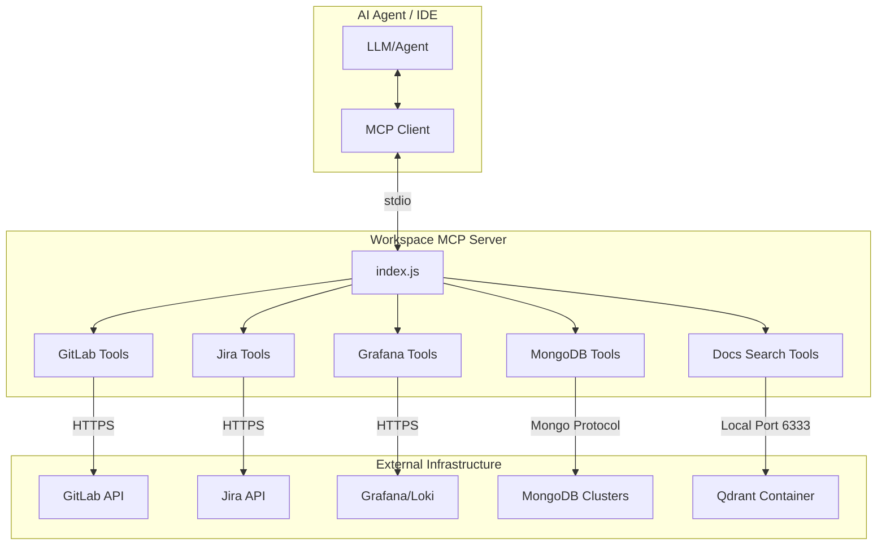

# Workspace MCP Server Guide

This guide describes how to configure, run, and develop the Workspace MCP Server. The server provides AI agents with tools to interact with the team's GitLab, Jira, Grafana, and MongoDB systems, and to query documentation using hybrid semantic search.

---

## Architecture Overview

The MCP Server runs in Node.js (v22+) as a standard input/output (stdio) subprocess spawned by your AI Agent (e.g. Kiro IDE, Claude Desktop, or Cline).



---

## Security and Data Privacy Constraints

> [!CAUTION]
> **Important Security Boundaries:**
>
> 1. **Strict Read-Only Access for Databases**:
>    - All MongoDB-related tools (`mongodb_find`, `mongodb_count`, `mongodb_aggregate`, `mongodb_list_collections`) are coded **strictly for read-only retrieval**.
>    - **Do not modify these tools** to support insert, update, replace, delete, drop, or write commands. The MCP client should not have write privileges to database clusters to avoid accidental corruption or data loss.
>
> 2. **Production Data Risk**:
>    - Be extremely cautious when supplying connection strings for production databases (`MONGODB_ENVS`) or API tokens for production GitLab/Jira instances.
>    - AI agent providers process data externally; sending real production payloads, customer data, or proprietary codes through the MCP server tools to models can cause sensitive data to leak outside the company security boundary.
>    - It is highly recommended to only use test, UAT, or sanitised staging database instances with the local MCP server.

---

## Configuration Setup

All credentials and options are configured in the `.env` file at the root of the workspace.

1. Copy `example.env` from the root of the workspace to `.env`:

   ```bash
   cp example.env .env
   ```

2. Populate the required tokens:
   - `GITLAB_PAT`: Your GitLab Personal Access Token.
   - `JIRA_PAT`: Your Jira Personal Access Token.
3. Configure target environments for MongoDB and Grafana as needed (defined as JSON maps in the environment variables).

---

## Option 1: Basic Operation (Always-On)

Without any extra dependencies, the MCP server provides:

- Full GitLab merge request review and pipeline control tools.
- Jira ticket details fetching and ticket creation.
- Grafana Loki log querying across configured environments.
- MongoDB document querying and count operations.
- `docs_map` outline tool which parses and indexes all markdown files under `docs/` in memory.

---

## Option 2: Hybrid Docs Search (Opt-in)

The `docs_search` tool uses a local Qdrant vector database and Transformers.js to perform semantic and keyword retrieval over all team docs, Monorepo library READMEs, and deployment manuals.

### How to Enable

1. **Install Heavy Dependencies**:

   ```bash
   cd mcp && yarn install
   ```

2. **Launch Qdrant Container**:
   Ensure Docker (or `wslc` on Windows) is running, then set in `.env`:

   ```env
   DOCS_SEARCH_ENABLED=true
   QDRANT_ENGINE='docker' # or 'wslc'
   ```

3. **Download Model**:
   Run the pre-download script so the model is cached before starting the server:

   ```bash
   yarn docs:download-model
   ```

### Daily Auto-Ingestion and Alias Swapping

The indexer runs on startup (if the index is missing) and schedules a daily rebuild in the background. It uses a **blue-green deployment pattern** inside Qdrant:

1. A new collection is created with a timestamp (e.g. `workspace_docs_20260703160000`).
2. Documents are parsed, chunked, embedded, and upserted.
3. Once successful, the `workspace_docs` alias is atomically pointed to the new collection.
4. The old collection is dropped.
This guarantees search never goes down during ingestion.

---

## Debugging and Development

### Running the MCP Inspector

To test tools interactively, run the inspector from the `mcp/` directory:

```bash
cd mcp
yarn start:dev
```

This starts the stdio server inside the Model Context Protocol Inspector UI, allowing you to click tools and input arguments manually to check API responses.

### Troubleshooting Connection Errors

- **GitLab/Jira 401 Unauthorized**: Check that tokens in `.env` are valid and haven't expired.
- **Qdrant Connection Failed**: Check that Qdrant is running by listing containers (`docker ps` or `wslc container list`).
- **No Search Results**: Force an index rebuild using `yarn docs:ingest` and verify the log output.

---

## Tool Execution Paradigms: MCP Server vs Connectors

The workspace supports two parallel execution paradigms to provide agents with capabilities:

1. **Model Context Protocol (MCP)**: Persistent stdio-based server that registers tools inside the agent system context (defined in `./mcp`).
2. **Connectors**: Individual shell scripts executed by the agent via CLI command-line parameters (defined in `.ai/connectors`).

These can run independently or simultaneously. Both approaches load credentials from the **root `.env` file** to centralise environment variable maintenance.

### Decision Matrix: When to use MCP vs Connectors

| Criteria | MCP Server | Connectors |
| --- | --- | --- |
| **Primary Use Case** | Frequently-used, general-purpose workflows (e.g., fetching Jira issue details, listing GitLab MRs). | One-off, highly-specialised or skill-specific actions (e.g., running a specific database migration, compiling a special localized report). |
| **Discovery** | Automated. The agent discovers all schemas on server boot. | Manual. The agent lists directory files, reads README instructions, and runs scripts. |
| **Model Context Impact** | Permanently consumes prompt tokens since all schemas are sent in the LLM's system instructions. | Dynamic. Connectors are only read and executed when needed, but locating/describing them can steal prompt tokens during file exploration. |
| **Implementation Complexity** | Requires registering tool schemas and request switch handlers. | Simple self-contained Node.js `.mjs` scripts. |
