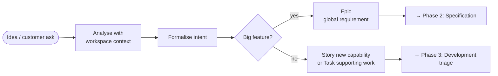

# Phase 1 · Origination

**Owner:** BA / PO

Where work is born. The BA turns an idea or a customer ask into a tracked,
context-grounded intent and the right tracker artifact.

## Steps

1. **Capture the idea** — a feature concept, or a request from a stakeholder or customer.
2. **Analyse it against the system we actually have.** Read the team docs (`docs/`),
   the [architecture overview](../architecture/architecture.md) and the
   [service relations](../architecture/api-contracts.md), and use `docs_search` /
   `docs_map` to find the areas involved. This is the step that makes the intent
   realistic rather than abstract, and it is the one most often skipped.
3. **Formalise the intent.** Write down the problem, the desired outcome, who it is for,
   and the constraints.
4. **Create the tracker artifact:**
   - **Big feature → Epic.** The Epic is the *global requirement of record*; the full
     intent lives there. It is broken down into **Stories** — one per new capability —
     in Phase 2 or 3.
   - **Small work → Story or Task.** A new capability is a Story; supporting work is a
     Task. No Epic of its own, no spec; it flows straight into development triage.



---

## Tracker conventions

These apply to **newly created issues**. An existing backlog is not retyped or renamed to
match — that churn buys nothing.

### Which issue type

| Type | Use for | Notes |
| --- | --- | --- |
| **Epic** | A big feature that will get a spec, **or** a recurring release bucket (below) | Only Epics carry the global intent |
| **Story** | **Introduction of a new capability** — a new endpoint, a UI change a user notices, new processing behaviour, a new business rule | The main child type of a feature Epic. Always Epic-linked |
| **Task** | Supporting work that introduces no new capability — verification, automation, documentation, config, release chores, tooling | — |
| **Bug** | A defect in already-delivered behaviour | Needs the environment it was seen in, and the affected version |

**The distinction that matters is capability vs. support, not size.** A one-line change
that exposes a new field on an endpoint is a Story; a week of test automation is a Task.

Do not create sub-tasks at origination — decomposition happens in Phase 2 or 3.

### Stories and Epics

A Story is the increment a stakeholder would recognise as "the thing arrived". It always
belongs to a feature Epic.

- Origination produces the **Epic**. Stories appear when the Epic is broken down — during
  spec seeding (Phase 2) or planning. A small, self-contained capability under an existing
  Epic can be raised as a Story directly here.
- A Story's description carries the user story (`As a <role>, I want …, so that …`) and its
  acceptance criteria. When the feature has a spec, the criteria live in `requirements.md`
  and the Story links to it rather than restating them — two copies of a criterion is one
  copy too many.
- **One service, one issue.** All the work landing in one repo is a single Story, however
  many requirements it satisfies. Do not raise an issue per requirement, per column, per
  filter, or per screen element. Two repos means two issues. Non-code items — technical
  design, manual QA, automation, data backfill, infra config — are their own issues
  regardless. Full rule and the sanity check:
  [`requirements-and-estimates.md`](../../.ai/rules/requirements-and-estimates.md#one-service-one-issue).
- **Slicing one capability across Stories** is fine when delivery is genuinely staged.
  Mark the slice with a trailing ` - <slice>`:

  ```txt
  [products-service] Provide product availability sync - Subscribe (no logic)
  [products-service] Provide product availability sync - Processing logic
  ```

### Recurring bucket Epics

Not every Epic is a feature. Each release version gets a fixed set of **bucket Epics**,
created once per version, that loose work hangs off. They are internal bookkeeping, and
release notes treat them differently from feature Epics.

| Bucket Epic | Holds |
| --- | --- |
| `Support \| <ver>` | Support and incident bugs |
| `QA Items \| <ver>` | Manual verification and automation work |
| `Tech Improvements \| <ver>` | Refactors, tech debt, infra, observability |
| `Security Updates \| <ver>` | CVE, container-scan and dependency work |
| `Release Preparation \| <ver>` | Release mechanics |

### Summary naming

**Feature Epic:** `[<Topic>] <Business outcome>`

Write the outcome, not the mechanism — a summary a stakeholder can read without asking a
developer what it means.

**Story / Task / Bug:** a leading prefix that says where the work lands, then the
capability or outcome.

| Prefix | Meaning |
| --- | --- |
| `[<repo-name>]` | Scoped to one repo — `[users-service] Paginated account listing` |
| `[<repo>][<repo>]` | Stacked when one capability spans repos — `[products-service][products-frontend] …` |
| `[backend]` / `[frontend]` | When the capability is broader than a single named repo |
| `[UI/UX]` | Design work for an upcoming UI capability |
| `[SPIKE]` | Time-boxed investigation — always a **Task**, since it delivers no capability |
| `[<EpicKey>]` | Derived from a spec's task breakdown — `[TW-1287] …` |
| `[QA]` / `[Automation]` | Manual verification and automation items |
| `[Support]` | Originated from support or an incident |

Status and dependency markers go **in front** of the prefix: `[BLOCKED]`,
`[Depends on TW-1290]`. Add a trailing `(cross-team)` when another team has to do the work.

### Fields at creation

| Field | Rule |
| --- | --- |
| Reporter | The BA/PO, unless you are relaying a ticket raised by someone else |
| Priority | `Medium` by default. `High` / `Critical` must be justified in the description |
| **Epic link** | **Mandatory for Stories**; set it on Tasks and Bugs too — the feature Epic or the right bucket Epic |
| Fix version | The release the work is committed to. Leave it empty while the item is uncommitted — a version on an uncommitted item reads as a promise |
| Labels | Keep the taxonomy thin. A label nobody filters on is noise that has to be maintained |
| Environment / Affects version | Bugs only — where it was seen (`dev` / `test` / `prod`) and which version |

### Epic description skeleton

This is what makes the Epic the requirement of record. Fill every heading; write "none"
rather than dropping one.

```txt
Problem / trigger       — what is wrong or newly needed, and what surfaced it
Desired outcome         — the observable end state, in business terms
Who it's for            — the roles and stakeholders who benefit
Constraints & non-goals — what must not break, what is explicitly out of scope
Source documents        — the links that authorise the change
Open questions          — what is still undecided, and who owns the answer
```

### Status at origination

`Funnel` (captured, not committed) → `Analyzing` (BA working the intent) → `Backlog`
(intent ready, fix version assigned).

Assign a fix version only when the item reaches Backlog.

---

## Intent: the tracker vs. the spec README

**The tracker is written for people without the workspace. The spec is written for the
people building it.** That single line resolves most "where does this go?" questions.

| Content | Epic | Spec `README.md` |
| --- | --- | --- |
| Problem, desired outcome, who it's for | **owns** | one-line echo + link |
| Business justification, stakeholders | **owns** | — |
| Source documents | **owns** | listed in Related Artifacts |
| Priority, fix version, cross-team links | **owns** | status only, in Related Artifacts |
| Which system surfaces the change touches | — | **owns** (Intent) |
| Compatibility constraints a developer must respect | one line | **owns** |
| 1–3 sentence feature summary | optional | **owns** (Summary) |
| Glossary, EARS criteria, business rules, UX | — | **owns** (`requirements.md`, `design.md`) |
| Technical design, task breakdown, tests | — | **owns** (Stage B artifacts) |

**The size test.** The Epic description is long enough when a stakeholder can decide
priority without asking anyone. The README Intent is long enough when a developer knows
which surfaces are affected and what must not break — roughly 150 words plus the Epic
link. If the README Intent grows past a screen, it has become design: move it into
`design.md`.

**When something changes.** Intent changed → update the **Epic first**, then mirror it into
the README and bump the spec version. Behaviour detail changed → **spec only**; do not edit
the Epic.

> **The drift to watch for.** An Epic whose description is just a link to a source
> document, with the real intent living in the spec README, inverts this rule — the people
> who need the intent most are the ones without the repo. When you touch such an Epic,
> backfill its description using the skeleton above.

---

## Hand-off

- Epic → **Phase 2 (Specification)**: the BA seeds a spec.
- Story / Task → **Phase 3 (Development)**: a developer picks it up and triages it.

## Outputs

- An **Epic** for a feature, or a **Story** / **Task** for small work.
- A formalised intent, recorded in the Epic and later mirrored in the spec README.
