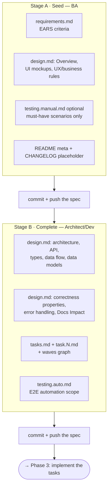

# Phase 2 · Specification (SDD)

**Owners:** BA (seed) → Architect / Dev (complete)

For big features only. The spec is authored **collaboratively in two stages by different
roles**, and shared through this repo — commit and push is how the hand-off happens.
Backed by the [`author-spec`](../../.ai/skills/author-spec/SKILL.md) skill.

> A developer picking up an already-complete spec does **not** re-run this phase. They go
> straight to implementing its tasks (Phase 3).

## Stages and ownership

Each stage owns specific sections. **Never overwrite another stage's sections** — fill your
own, leave theirs as placeholders, and flag the gaps you need them to close.



### Stage A — Seed (BA)

The non-technical foundation:

- **`requirements.md`** — Introduction, Glossary, numbered requirements with EARS
  acceptance criteria (`WHEN <trigger>, THE System SHALL <observable behaviour>`), each
  independently testable. **This is the mandatory artifact of the stage** — the technical
  design, the tasks and the QA coverage are all measured against it. How to write one:
  [`requirements-and-estimates.md`](../../.ai/rules/requirements-and-estimates.md).
- **`design.md`, non-technical sections only** — Overview, UI mockups, UX and business
  rules.
- **`testing.manual.md` — optional.** Seed scenarios only where a specific case must
  demonstrably be covered, or to sketch a basic happy path. Designing full coverage is not
  the BA's job — see [Test coverage belongs to QA](#test-coverage-belongs-to-qa). Seed the
  shared `data-testid` contract stub in `testing.md` if the feature has UI.
- **`README.md` + `CHANGELOG.md`** — metadata, intent (the full intent stays in the Epic),
  summary, Implementors, Progress. The CHANGELOG is left as the v1.0 placeholder.

Then **commit and push**, so an architect or developer can pick it up.

### Stage B — Complete (Architect / Dev)

The technical layer:

- **`design.md`, technical sections** — architecture and component structure, API layer,
  types, data flow, data models, **correctness properties** (invariants that map back to
  requirement criteria), error handling, testing strategy, and **Docs Impact**.
- **`tasks.md` + `task.N.md`** — decompose into the smallest independently deliverable
  units. Multi-repo work defines the shared contracts first and implements provider before
  consumer. Each task file is concrete enough for the executor to follow: repo, project ID,
  files, snippets, commit message, delivery step. Fill in the `waves` dependency graph.
- **`testing.auto.md`** — the E2E automation scope.

Then implement (Phase 3), or **commit and push** for later.

---

## Test coverage belongs to QA

`testing.manual.md` in a seeded spec is a **floor, not the plan**. The BA contributes
scenarios only for cases that must demonstrably be present, plus a basic path if they want
one. Neither the BA nor the developer designs the coverage.

**The QA engineer owns designing and executing the full set of scenarios**, working from
`requirements.md` and its acceptance criteria as the source of truth.

The reason is accuracy, not workload. A BA writes scenarios from what they *intended*; a
developer writes them from what they *built*. Both are blind in exactly the places that
matter. QA deriving coverage independently from the criteria keeps that bias out of
verification, so a scenario can fail because the feature is wrong rather than because
everyone agreed on the same wrong assumption.

Practical consequences:

- **A spec with no `testing.manual.md` is not incomplete.** Its absence means the BA had no
  must-have case, not that coverage is missing.
- **QA may add, restructure or replace scenarios freely** — including ones the BA seeded —
  as long as every acceptance criterion ends up covered. Tag each scenario with the
  requirement it validates, so coverage traces back to `requirements.md`.
- **A criterion QA cannot write a decidable scenario for is a requirements defect.** Raise
  it against the criterion rather than inventing an interpretation. That feedback is one of
  the more valuable things this split produces.

---

## Who authors the technical layer, and who implements it

Stage B is **assigned by expertise, not by who will write the code.** The spec is the
source of truth for everything downstream, so the quality of the technical design caps the
quality of the result — it is worth the most experienced person available.

A good spec is what makes the hand-off to implementation work at all: the implementer
inherits the decisions instead of re-deriving them. Implementation may then be done by the
spec's author, by someone else, or **by several developers in parallel** — the `task.N.md`
files are independently deliverable by design, and the `waves` graph in `tasks.md` states
which may run concurrently and which ordering rules apply (providers before consumers,
migrations after the code that writes the new values).

**Scope tasks by service or library, not finer.** Over-granular tasks create coordination
cost without buying parallelism, and they fight the *one MR per service* rule in Phase 3.
One repo's worth of work in one task is the shape that parallelises cleanly.

---

## Amendments — the default is the same spec

**Later change to a feature normally lands in its original spec**, as a versioned
amendment. That covers all of:

- requirements changed **during** implementation, or **after** it;
- a blocker or a wrong assumption revealed while implementing;
- problems found post-implementation, in testing or in production;
- adjustments agreed in review, or a follow-up ticket refining the feature.

The one thing that is never acceptable is an **undocumented deviation** — changed behaviour
that exists only in code or a commit message.

A big enough rework is the exception and gets its own linked spec — see
[Amend, or start a new spec?](#amend-or-start-a-new-spec). Decide that first; the mechanics
below apply once you have chosen to amend.

The mechanics, every time:

1. Edit the affected criteria in `requirements.md` / `design.md` **in place**. Keep
   criterion numbers stable and annotate inline: `<!-- v1.2, TW-1290: was … -->`.
2. Add any new `task.N.md` and link it from `tasks.md`.
3. Bump **Version** and **Updated at** in `README.md`, and update the Progress table.
4. **Always add a CHANGELOG entry** — Source, Changed / Added / Fixed, and an Impact list
   of every file touched.

A code-only fix that changes nothing documented needs no version bump, but it still belongs
in the CHANGELOG under *Fixed (code-only, no spec change needed)*, so the record is
complete.

Why the default leans this way: the spec is the artifact somebody will read months later to
understand why the feature behaves as it does. Scatter that history across documents and
none of them is authoritative; leave a change out entirely and the spec actively misleads.
A superseded criterion with a recorded reason is useful. One that still reads as current is
worse than no criterion at all — which is exactly why amendments annotate in place.

## Amend, or start a new spec?

Amending is the default, not a rule. **When the incoming scope is large enough, a new spec
linked to the old one is the better answer** — and that is a planning decision, normally the
BA's, taken while the work is being shaped rather than discovered mid-implementation.

| Points to amending | Points to a new, linked spec |
| --- | --- |
| Same business outcome, sharpened | The outcome itself is different — this supersedes rather than refines |
| Affected criteria can be edited in place and still read coherently | An amended `requirements.md` would be dominated by superseded wording, so "what is current" becomes ambiguous |
| Same surfaces and services; the task breakdown mostly holds | Little of the task breakdown or technical design survives |
| Ships as part of the same effort | Has its own Epic, timeline and fix version, and ships independently |
| The original is still in flight | The original is delivered and closed; this is a distinct next phase |

**The deciding question is which document a newcomer could trust.** The amendment habit
exists so history is not scattered — but a spec amended past the point where current and
superseded criteria are distinguishable fails that same test, and the ambiguity then costs
the quality of the new work. That is precisely when to start fresh.

When a new spec is agreed, keep the history navigable:

1. The **new** spec's Intent says what it supersedes or continues, and links the
   predecessor.
2. Its **Related Artifacts** table carries a row for the predecessor spec.
3. The **old** spec gets a version bump and a CHANGELOG entry recording that the scope
   moved, linking forward. Without this, the superseded spec silently reads as current.
4. The old spec's delivered content stays intact — do not strip criteria out of it.

The signal table also lives in
[`work-triage.md` § Second decision](../../.ai/rules/work-triage.md#second-decision-the-work-touches-a-feature-that-already-has-a-spec),
which is what the agent loads when triaging.

---

## Why specs stay in the repo

Specs are **kept, not consumed.** A delivered spec is the durable record of *why* — which
options were weighed, which decision was taken and by whom, what was deliberately left out,
and which constraint from another team forced an awkward shape. That is exactly the context
a commit history does not carry, and it is what makes a feature cheap to pick up later (see
[Feature Owning](./03-development.md#feature-owning)).

**The caveat is the search index — and here it is decided rather than open.** `docs/SPECs/`
is excluded from the `docs_search` corpus, from day one, because retrieval has no notion of
*planned* versus *shipped*: a spec for a feature that was never built reads exactly like
documentation of one that works. The full reasoning is in
[`docs/SPECs/README.md`](../SPECs/README.md#excluded-from-the-search-index--on-purpose) and
in the comment block in [`mcp/src/docs/sources.js`](../../mcp/src/docs/sources.js).

This does not make specs less useful. An agent pointed at `docs/SPECs/` reads them
directly, *knowing what they are*. The exclusion only stops them competing with reference
documentation in a single undifferentiated ranked list.

## Spec anatomy

```txt
docs/SPECs/<code>-<slug>/
├── README.md          # metadata, intent, implementors, progress, links
├── requirements.md    # EARS acceptance criteria             (Stage A)
├── design.md          # non-technical (Stage A) + technical  (Stage B)
├── tasks.md           # task index + waves dependency graph  (Stage B)
├── task.N.md          # one per deliverable unit             (Stage B)
├── testing.md         # index + data-testid contract
├── testing.manual.md  # must-have scenarios only   (Stage A, optional)
│                      #   QA owns the full set — see Phase 4
├── testing.auto.md    # E2E automation scope                 (Stage B)
└── CHANGELOG.md       # from v1.1 onward
```

Template: [`docs/SPECs/_template/`](../SPECs/_template/README.md).

## Hand-off and outputs

- Stage A → "ready for an architect or developer to complete."
- Stage B → "ready to implement — see `tasks.md`."
- The Progress and Implementors tables in the README track who did what, and when.
