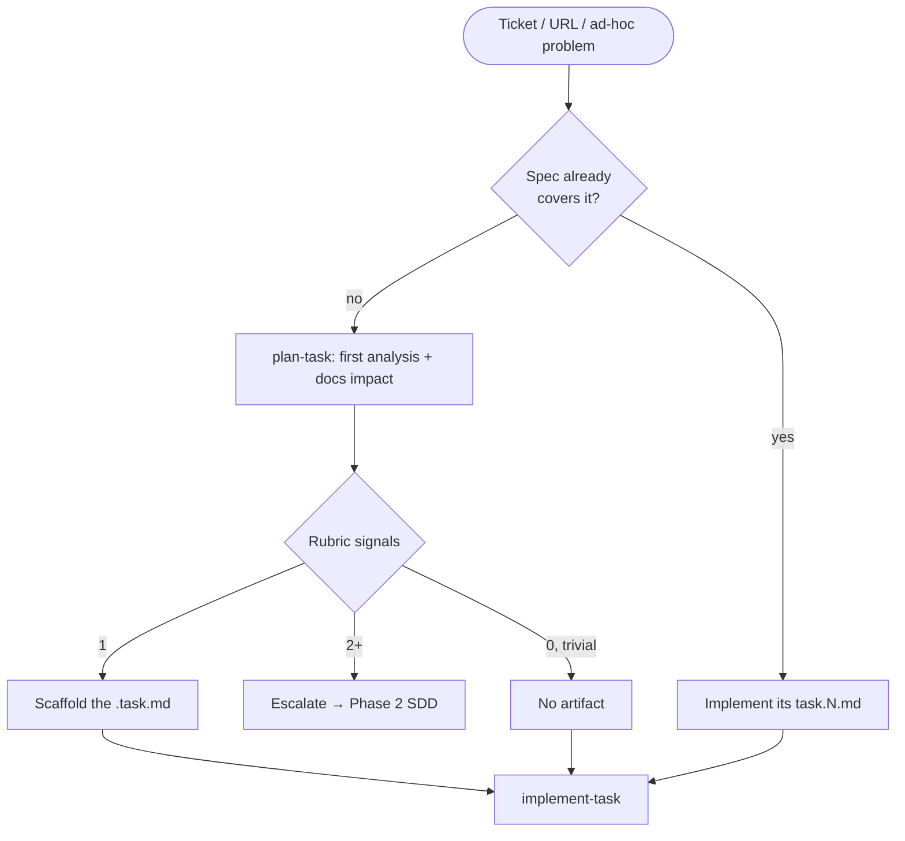
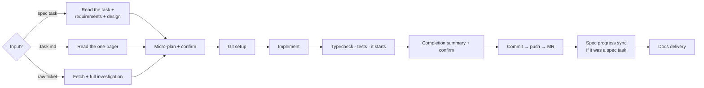
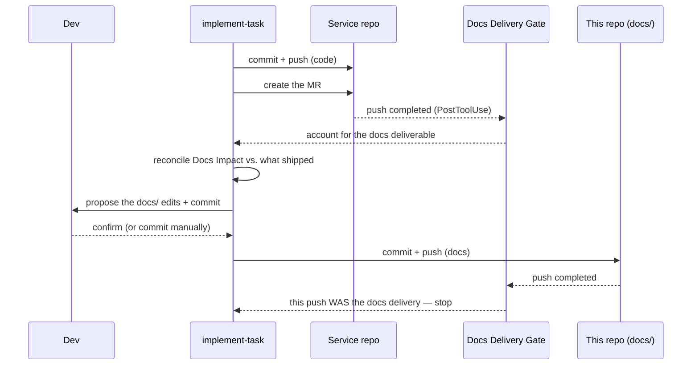

# Phase 3 · Development

**Owner:** Dev

Where work becomes shipped code. A developer either picks up tasks from a ready spec, or
triages an incoming ticket or ad-hoc problem into the right tier, then implements and
delivers it. Backed by [`plan-task`](../../.ai/skills/plan-task/SKILL.md) and
[`implement-task`](../../.ai/skills/implement-task/SKILL.md).

## Entry: triage

`plan-task` is the front door for work that arrives without a predetermined path. It
intakes a ticket code, a URL, pasted details, or an ad-hoc problem with no ticket at all,
runs a light first analysis, and routes to one of three tiers using the
[`work-triage`](../../.ai/rules/work-triage.md) rubric. It always **proposes** and waits —
the developer's choice wins.

> If a spec already covers the work, skip triage entirely and implement its `task.N.md`
> files.

### The three tiers

| Tier | Artifact | For |
| --- | --- | --- |
| **spec** | [`docs/SPECs/<code>-<slug>/`](../SPECs/README.md) | A big or risky feature → **escalate into Phase 2**, looping in the BA and architect |
| **task** | [`docs/tasks/<code>.task.md`](../tasks/README.md) | Small, well-understood work worth a one-pager |
| **direct** | _none_ | A trivial, low-risk fix |

### The rubric, in one line

Count how many of these fire: multi-repo · cross-team · needs non-dev roles ·
data-model or contract change · UX sign-off · many unknowns · hard to reverse ·
long-lived or phased.

**2+ → spec** · **1, or a single-repo change that still wants a plan → task** ·
**0 and trivial → direct.** When it is genuinely ambiguous, pick the **lighter** tier —
SDD overhead on small work defeats the purpose.

---

## The executor: implement-task

One engine implements any unit of work — a spec `task.N.md`, a `.task.md` one-pager, or a
raw ticket.

What is worth knowing about it without reading the whole skill:

- **A lightweight in-chat micro-plan is confirmed before any file is touched.** The durable
  plan lives in the artifact; the micro-plan is just the "am I about to do the right
  thing?" checkpoint.
- **The gates are typecheck, tests, and the service starting** — never the linter. Failing
  *existing* tests stop the flow and are reported, not edited around. See
  [`code-style.md`](../../.ai/rules/code-style.md).
- **Git follows [`git-workflow.md`](../../.ai/rules/git-workflow.md)**: branches
  `{type}/{TASK-CODE}-{short-description}`, Conventional Commits with the task code as the
  scope, and pushes through `gitlab_safe_push` — never raw `git push`.
- **Nothing is committed, pushed or opened as an MR without explicit approval for that
  specific action.** Approval for the commit is not approval for the push.
- **Spec progress is synced** when the unit came from a spec: `tasks.md` gets its checkbox
  ticked with the outcome, and the README Progress table gets stamped and its `Updated at`
  bumped. A spec whose progress table lies is worse than one with no progress table.

---

## Docs delivery

Team docs under `docs/` live in **this** repo. The code you just delivered lives in a
service repo with its own remote and its own MR. So docs never ride in the service MR —
they are their own commit here, delivered right after the code is pushed.

1. **Declared at plan time** — the `Docs Impact` section of the `.task.md`, or of the
   spec's `design.md`. Deciding this while planning is what stops it becoming an
   afterthought.
2. **Triggered after the push** — the *Docs Delivery Gate* hook
   (`scripts/hooks/docs-delivery-gate.mjs`) fires on a completed push and tells the agent
   to account for the deliverable.
3. **Prepared and proposed** — the agent reconciles the planned impact against what
   actually shipped, prepares the `docs/` edits, and **proposes** committing them. It never
   auto-pushes docs. If there is genuinely no impact, it says so explicitly — a conscious
   "none" rather than a silent omission.

Two things make this worth the ceremony. Documentation written a week later is written from
memory, by which point the non-obvious decision — the one worth documenting — has been
forgotten. And an indexed doc that is now wrong is worse than a missing one: `docs_search`
will answer from it confidently.

**The task is not done until the docs deliverable is shipped or consciously skipped.**
After editing anything in the indexed corpus, say that the search index is stale for it —
the agent must not run `yarn docs:ingest` itself
([`local-environment.md`](../../.ai/rules/local-environment.md)).

---

## Feature owning

**The preferred way to work a spec: one developer owns the whole feature.** The same person
from the technical spec through to it running in production — task breakdown,
implementation, MR, promotion through `test` to `prod`, and the fixes that come out of
testing.

The BA still owns **requirements**. Feature owning is about the technical lifecycle, not
about a developer deciding what the business needs.

Why it beats passing a feature between hands:

- **The owner accumulates the full context** — not only what was built, but which options
  were rejected, which external constraint forced an awkward shape, and where the fragile
  edges are.
- **Issues get diagnosed at the speed of someone who already knows the answer.** A bug from
  `test` lands on the person who knows which of the eleven tasks could have caused it.
- **Quality holds across the seams.** Most defects live in hand-offs — backend to frontend,
  code to deployment, deployment to verification. Removing the hand-offs removes the seams.

### The bus-factor objection

The usual objection is bus factor, and in practice it is small here: **any developer can
pick the feature up from the spec plus the workspace.** The spec carries the requirements,
the design, the decisions and their reasoning, the task breakdown with its ordering rules,
and a CHANGELOG of everything that changed since v1.0. Ramp-up is reading time, not
re-investigation.

That is precisely what the spec is *for* — see
[Why specs stay in the repo](./02-specification.md#why-specs-stay-in-the-repo). Feature
owning **without** a spec would carry a real bus-factor risk. With one, it does not.

### It is a preference, not a constraint

Parallel work across one spec is fine and often right — see
[who authors vs. who implements](./02-specification.md#who-authors-the-technical-layer-and-who-implements-it).
The point is that **each unit has a clear owner who sees it through to production**, not
that a feature may never be split.

---

## Code review

Reviews go through the [`review-mr`](../../.ai/skills/review-mr/SKILL.md) skill, which
resolves the MR, reads the existing discussion, gathers the ticket, spec, task and docs
context, checks the branch out read-only, and drafts findings for **per-item approval**
before anything is posted. It never comments or approves without an explicit go-ahead, and
it never drops a valid finding for being out of scope — out-of-scope items are labelled and
routed to their own ticket.

When it is actually worth reaching for:

- **MRs from other teams into our code** — the main case. It carries the ownership rules,
  so it reviews correctness and cross-service impact without pushing our conventions onto a
  repo we do not own.
- **Complex changes where a second pair of eyes pays for itself** — a large spec task, an
  auth or data-model change, anything with awkward merge ordering.

We do **not** routinely review each other's MRs. With feature owning, and a spec that was
already reviewed at its gates, blanket peer review buys little; targeted review of the
risky changes buys more.

---

## Naming

| Artifact | Path |
| --- | --- |
| Task one-pager | `docs/tasks/TW-1287.task.md` — or `TW-1287.1.task.md`, `.2.` for several |
| Spec | `docs/SPECs/TW-1287-<short-slug>/` |
| Branch | `feat/TW-1287-paginate-products` |
| Commit | `feat(TW-1287): added cursor pagination to the products list endpoint` |

Ad-hoc work with no ticket uses the code `TW-0` and is almost always `direct`.

## Hand-off

- Service MR → merge, reviewed via `review-mr` where review is warranted.
- Automation scope from the spec → **Phase 4** for AQA, or a developer implementing it from
  QA's manual scenarios.
- **Phase 4 for QA**, who designs the scenarios from `requirements.md` and its acceptance
  criteria. Any BA-seeded `testing.manual.md` is a set of must-haves, not the plan.
- Under feature owning, the same developer stays with the feature through Phase 4:
  promotion to `test` and `prod`, and any fixes verification turns up.
