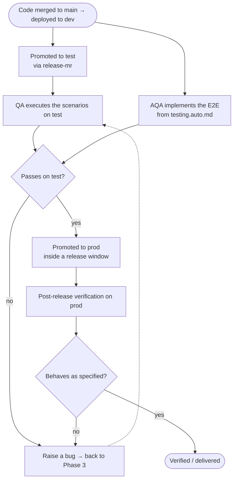

# Phase 4 · Verification

**Owners:** Manual QA + AQA

Where a delivered change is proven correct — through manual scenarios, end-to-end
automation, and verification after promotion — before it counts as done.

## Inputs

- **`requirements.md` and its acceptance criteria** — the actual basis for coverage. QA
  designs scenarios from these, not from the implementation.
- **Any scenarios already in the spec** — `testing.manual.md`, *if* the BA seeded some in
  Phase 2. Optional, and a floor rather than the plan.
- **Automation scope** — `testing.auto.md`, plus the shared `data-testid` contract in
  `testing.md` (both defined in Phase 2, Stage B).
- The merged code and its MR from Phase 3.

## Coverage is designed by QA, from the criteria

The BA seeds `testing.manual.md` only where a specific case must demonstrably be covered,
or to sketch a basic path — often not at all. **Designing the full set of scenarios is the
QA engineer's job**, derived from `requirements.md` and its acceptance criteria.

This is deliberate insulation, not a division of labour. A BA writes scenarios from what
they intended; a developer from what they built. Both are blind in the same places. QA
deriving coverage independently keeps that bias out of verification, so a failing scenario
means the feature is wrong rather than that everyone shared an assumption.

In practice:

- **Start from the criteria, not from the seeded scenarios and not from the code.** Read
  `requirements.md` first; treat any existing `testing.manual.md` as cases that must
  survive, then design around them.
- **Add, restructure or replace freely** — including BA-seeded scenarios — provided every
  acceptance criterion ends up covered and each scenario is tagged with the requirement it
  validates, so coverage traces back to `requirements.md`.
- **An empty or missing `testing.manual.md` is not a gap in the spec.** It means the BA had
  no must-have case.
- **A criterion you cannot turn into a decidable pass/fail scenario is a requirements
  defect.** Raise it against the criterion instead of picking an interpretation — that
  feedback is one of the more valuable outputs of this split.

## Flow

Verification follows the promotion path, and the two are not independent: a change is
verified on `test` before it is eligible for `prod`, which is the same one-directional rule
[`environments-and-ownership.md`](../../.ai/rules/environments-and-ownership.md) states for
versions.

`dev` is allowed to be broken — it tracks `main` on purpose. **`test` being broken is a
release blocker**, because `test` is what QA works against.

## Manual QA

Owns the scenarios: designs them from the acceptance criteria, records them in
`testing.manual.md` in the spec, then executes them on `test`, and again after promotion to
`prod` for anything a release window can plausibly break. Each scenario is tagged with the
requirement it validates, so coverage traces back to `requirements.md`.

Failures become bugs that re-enter Phase 3 — triaged as `task` or `direct`, or as a spec
amendment when the intended behaviour itself is what changed.

## AQA

Implements the E2E automation described in `testing.auto.md`, using the shared
`data-testid` values from `testing.md` so development and automation can proceed in
parallel rather than one waiting on the other. Automation may equally be implemented by a
developer, from QA's manual scenarios.

## Progress tracking

The spec `README.md` Progress table carries the verification end-states:

- [ ] Test scenarios designed from the criteria — @QA
- [ ] Automation tests — @AQA (or a developer, from the manual scenarios)
- [ ] Manual testing on `test` — @QA
- [ ] Promoted to `prod`
- [ ] Post-release verification — @QA

Ticking these closes out the lifecycle for the feature.

## Bugs and amendments

- A defect that does **not** change intended behaviour → a `task` or `direct` fix in
  Phase 3.
- A defect that reveals a requirement or design change → a **spec amendment**: bump the
  version, add a CHANGELOG entry, and update the affected criteria and tests.

A defect normally goes back into the **original spec**, however late it arrives —
including after the feature is live. See
[Phase 2 § Amendments](./02-specification.md#amendments--the-default-is-the-same-spec).

If verification exposes something big enough that reworking it would swamp the existing
requirements, that is a case for a **new linked spec** rather than an amendment — a
planning call, using the signals in
[Amend, or start a new spec?](./02-specification.md#amend-or-start-a-new-spec).

## What "done" means

A feature is done when all of these are true, and not before:

- Every acceptance criterion has a scenario, and every scenario passes on `test`.
- The automation scope in `testing.auto.md` is implemented, or consciously deferred with a
  reason recorded.
- The change is running on `prod` and has been verified there.
- The docs deliverable shipped, or was consciously skipped
  ([Phase 3 § Docs delivery](./03-development.md#docs-delivery)).
- The spec's Progress table reflects reality.

The last two are the ones that quietly go unticked, and they are the ones the next person
pays for.
