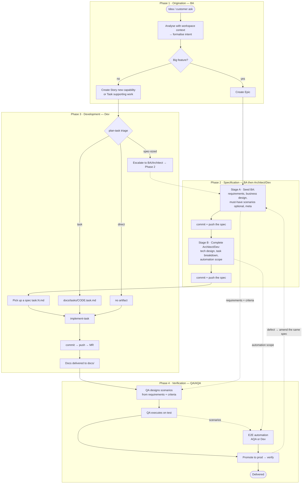

# SDLC — Ways of Working

How work gets from an idea to a delivered, verified change. The lifecycle has four
phases, each owned by a role, with explicit hand-offs. **Not every piece of work goes
through every phase** — big features run the full path, small work skips straight to
development, and a trivial fix gets no artifact at all.

## The four phases

| Phase | Owner | What happens | Detail |
| --- | --- | --- | --- |
| **1 · Origination** | BA / PO | Idea or customer ask → analysis against the workspace → a formalised intent → a tracker **Epic** (big feature), or a **Story** / **Task** for small work | [01-origination.md](./01-origination.md) |
| **2 · Specification** (SDD) | BA → Architect / Dev | Staged spec authoring: the BA seeds the non-technical parts, an architect or developer completes the technical parts and the task breakdown | [02-specification.md](./02-specification.md) |
| **3 · Development** | Dev | Triage (spec / task / direct) → implement → deliver (MR) → docs | [03-development.md](./03-development.md) |
| **4 · Verification** | Manual QA + AQA | Scenario design from the criteria, execution on `test`, E2E automation, sign-off on `prod` | [04-verification.md](./04-verification.md) |

Phase 2 runs **only for big features**. Small work goes Origination → Development
directly.

## Roles

Roles, not people. One person often wears several of these hats, and in a small team the
same engineer may be architect on one feature and implementer on the next. What matters is
that each phase has a named owner *for that piece of work*.

| Role | Owns |
| --- | --- |
| **BA / PO** | Origination; **requirements** — the source of business understanding for the whole life of the feature; seeds specs (business design, plus must-have scenarios only where a case must demonstrably be covered) |
| **Architect / Tech Lead** | Technical design decisions; completes specs; may implement |
| **Developer** | Completes the technical layer of specs, triages and implements units of work |
| **Manual QA** | **Designs** the test scenarios from the requirements and acceptance criteria — independently of the BA and the developer — then executes them on `test` and after promotion to `prod` |
| **AQA** | Implements the E2E automation from the manual scenarios |

Three consequences of that table are worth stating outright, because they are the parts
teams usually get wrong:

**The technical layer goes to expertise, not to the implementer.** The spec caps the
quality of everything downstream, so the strongest available engineer authors it. The
implementation may then be done by that person, by someone else, or by several developers
in parallel:
[02-specification.md](./02-specification.md#who-authors-the-technical-layer-and-who-implements-it).

**Test coverage is QA's to design.** Scenarios seeded by the BA are a floor, not the plan.
Keeping scenario design independent of what the BA intended and what the developer built is
what makes verification mean anything:
[04-verification.md](./04-verification.md#coverage-is-designed-by-qa-from-the-criteria).

**One developer carries a feature end to end** — from the technical spec through to it
running in production, including the fixes that come out of testing. The bus-factor
objection is answered by the spec itself:
[03-development.md](./03-development.md#feature-owning).

## Two entry points that converge

- **Top-down (SDD).** The BA originates a feature and seeds a spec; an architect or
  developer completes it, then its tasks get implemented.
- **Bottom-up (triage).** A ticket — or an ad-hoc problem with no ticket at all — arrives
  at a developer, who triages it into `spec` / `task` / `direct`.

They meet in Phase 3. BA-created small work flows into dev triage, and a developer whose
triage lands on `spec` **escalates back into Phase 2**.

## Master flow

## Tooling that backs this

The process is not only written down — it is encoded as skills the agent runs and rules the
agent is given. That is the difference between a wiki page people forget and a process the
tooling keeps you inside.

### Skills — [`.ai/skills/`](../../.ai/skills/README.md)

| Skill | Phase | What it does |
| --- | --- | --- |
| [`plan-task`](../../.ai/skills/plan-task/SKILL.md) | 3 (entry) | Intakes a ticket code, URL or ad-hoc problem, runs a light first analysis, scores the triage rubric and **proposes** spec / task / direct. Scaffolds the one-pager for the `task` tier |
| [`author-spec`](../../.ai/skills/author-spec/SKILL.md) | 2 | Authors or amends a spec in role-scoped stages with four mandatory review gates. Also owns amendments — which, by default, go back into the same spec |
| [`implement-task`](../../.ai/skills/implement-task/SKILL.md) | 3 | The single executor for any unit of work — a spec `task.N.md`, a `.task.md` one-pager, or a raw ticket: git setup, implementation, quality gates, MR, spec progress sync, docs delivery |
| [`review-mr`](../../.ai/skills/review-mr/SKILL.md) | 3 | Reviews an MR read-only with full spec and ticket context, drafts findings for per-item approval, and never posts or approves unprompted |
| [`debug-and-report`](../../.ai/skills/debug-and-report/SKILL.md) | 4 → 3 | Debugs from logs plus code and raises the bug, which re-enters development triage |
| [`release-mr`](../../.ai/skills/release-mr/SKILL.md) | 3 → 4 | Promotes a composition `dev` → `test` → `prod`, which is what puts a change in front of QA and then in front of users |

### Rules — [`.ai/rules/`](../../.ai/rules/README.md)

| Rule | Why it matters to this flow |
| --- | --- |
| [`work-triage.md`](../../.ai/rules/work-triage.md) | The spec / task / direct rubric — eight signals and the 2+/1/0 rule. The single source of truth for tier decisions, and for *amend an existing spec vs. start a new one* |
| [`requirements-and-estimates.md`](../../.ai/rules/requirements-and-estimates.md) | How to write EARS criteria, the gap-interrogation checklist, the *one service, one issue* slicing rule, and Fibonacci-only estimates |
| [`git-workflow.md`](../../.ai/rules/git-workflow.md) | Branch names, Conventional Commit types and what each does to the version, `gitlab_safe_push`, and what an MR description is for |
| [`code-style.md`](../../.ai/rules/code-style.md) | The real gates are typecheck, tests and the service starting — never the linter |
| [`environments-and-ownership.md`](../../.ai/rules/environments-and-ownership.md) | `dev` → `test` → `prod`, one direction; which repos are ours and which are read-only reference |
| [`docs-index.md`](../../.ai/rules/docs-index.md) | Search before you build; what the `docs_search` corpus covers and what is deliberately kept out of it |
| [`local-environment.md`](../../.ai/rules/local-environment.md) | Which commands the agent hands to the operator instead of running |

### Artifacts

| Artifact | Lives in | Created by |
| --- | --- | --- |
| Specs | [`docs/SPECs/<code>-<slug>/`](../SPECs/README.md) | `author-spec` |
| Spec template | [`docs/SPECs/_template/`](../SPECs/_template/README.md) | — |
| Task one-pagers | [`docs/tasks/<code>.task.md`](../tasks/README.md) | `plan-task` |
| Reference docs | the rest of `docs/` | `implement-task`, as the docs deliverable |

### Hooks

The **Docs Delivery Gate** (`scripts/hooks/docs-delivery-gate.mjs`) fires after a push and
makes the `docs/` deliverable a tracked step rather than an intention. See
[Phase 3 § Docs delivery](./03-development.md#docs-delivery).

## Where to start

| You are… | Read |
| --- | --- |
| Picking up a ticket right now | [SDLC Quickstart](../guides/sdlc-quickstart.md) |
| A BA turning an idea into work | [Phase 1](./01-origination.md) |
| Writing or completing a spec | [Phase 2](./02-specification.md) · [the template](../SPECs/_template/README.md) |
| Implementing something | [Phase 3](./03-development.md) |
| Designing or running test coverage | [Phase 4](./04-verification.md) |
| Wondering whether any of this is worth it | [SDD in Practice](./sdd-in-practice.md) |
